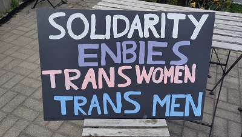

# Am I Still Being Misgendered After One Year?

For a year, I kept track of every time someone referred to me using the
correct or incorrect gender. Here are the results.

## The Idea

It all started when I came out as a trans woman in May 2024. I was
already “out” as a trans person by then, but until that point I had
identified as non-binary. I was using *they/them* pronouns in English
(most of my interactions are in English) and *iel* in French. It’s quite
hard to get people to use *they/them* correctly in spoken language,
especially if they’re not very young. And it’s even harder in France,
where hardly anyone knows the pronoun *iel*. I really empathize with
non-binary people dealing with that challenge.

But starting in May 2024, everything was about to change—I announced to
everyone that I now identified as a woman and would be using traditional
feminine pronouns. Still, I wondered whether it would actually work:
would people use my new pronouns correctly, or would they keep
misgendering\* me?

Since I tend to be pessimistic and focus on the negative instances
(i.e., when I get misgendered), I thought a good way to address this
would be to track statistics about my misgendering—to observe my
progress more objectively.

*\* **misgender:** Referring to someone using the wrong gender—for
example, by using incorrect pronouns or gendered terms.*

## Why Am I Doing This?

But why do I even want to be gendered correctly? Why is it important?

The reason is that being misgendered causes me gender dysphoria\*. When
someone misgenders me, I feel a kind of self-disgust, as if I’m
thinking, *“Ugh, that person sees me as a man.”* To be clear, it’s not
that I feel disgust toward men in general, but specifically toward the
idea that *I* might be seen as a man. If you’re not trans yourself, this
might sound strange or hard to imagine, but I assure you it’s a very
real feeling—one that most trans women and men can relate to (and some
non-binary people too).

*\* **gender dysphoria:** The discomfort trans people may feel when
aspects of their body or how others perceive them don’t align with their
gender identity.*

## Methodology

So here’s what I did for one year, from May 2024 to May 2025: every time
someone gendered me correctly or misgendered me, I recorded it. Since I
couldn’t open a spreadsheet every time, I created a dedicated Discord
channel where I would simply type “CG,” “AG,” or “MG” on my phone,
corresponding to the following cases:

- **CG** (Correct Gendering): Someone consistently gendered me correctly
  during a conversation—for example: *“You’re lucky to be learning with
  River, **she’s** an expert in Ansible programming.”* But it could also
  be something as simple as a stranger saying *“Thank you, ma’am.”*

- **AG** (Ambiguous Gendering): Someone initially misgendered me but
  then corrected themselves (either spontaneously or after I pointed it
  out) and went on to use the correct gender.

- **MG** (Misgendering): Someone misgendered me by exclusively using
  masculine pronouns or terms when referring to me in a conversation.

- **Transphobia**: I also recorded the rare transphobic interactions I
  experienced—such as when it was clear that someone misgendered me on
  purpose, insulted me, or subjected me to blatant discrimination.

Note that I only count one occurrence per person per day, even if that
person genders me multiple times in the same day.

I also exclude close family members to avoid skewing the statistics. My
close ones see me as my correct gender, but what I’m interested in here
is how people **who aren’t close to me** perceive me. On the other hand,
if I included my wife, for example, I could record a “free” CG every
day—but that wouldn’t be very meaningful for my analysis.

## Results

*Note: The "correct gendering" (green) curve is consistently the highest
throughout the chart.*

This chart shows the evolution of the frequency of the three categories
using a 10-day rolling sum.

When you transition and start observing how people gender you, it
quickly becomes clear that it mostly depends on your **visual
appearance** (and to some extent, your voice).

Some trans people completely change their appearance overnight, but in
my case, I made changes gradually—it was too overwhelming for me to do
everything at once. So, each time I made a change (like switching from
pants to skirts, for example), I needed some time to get used to it
before I could find the courage to make another change.

Here is the same graph, but now annotated with the dates on which I
changed aspects of my appearance.

## Analysis

The spike at the beginning where both the “correct gendering” and
“misgendering” curves are very high corresponds to my coming out and the
flood of interactions from people reacting to it—resulting in a surge of
gender-related interactions all at once.

For analyzing these data, it’s actually more insightful to focus on the
“ambiguous” and “misgendering” curves (the two lower ones), rather than
the “correct gendering” curve (which is the highest). That’s because
many people who know me gender me correctly every day, creating a kind
of constant “flow” of correct gendering. On the other hand, people who
misgender me are often strangers who base their choice of pronouns
entirely on my appearance.

Wearing a headband across my forehead starting in July 2024 was a major
change in terms of my gender dysphoria. For me, it made all the
difference between seeing a man or a woman in the mirror. Later on, I
underwent a hair transplant surgery to get hair on the top of my
forehead so I could stop hating my appearance when I saw myself without
the headband.

It’s also important to consider that my face gradually changed due to
the effects of feminizing hormones. Here are a few photos showing my
physical evolution over the same period as my analysis:

May 2024 / July 2024 / May 2025

But to be honest, the most striking pattern is that **wearing a skirt
changes everything**. As soon as winter started and temperatures dropped
to 0°C, I stopped wearing my short skirt and switched to pants—and
suddenly, I got misgendered much more frequently (that red spike in
October on the chart). Later, I found a long, warm skirt that I could
wear in winter (sometimes with pants underneath when it was below
freezing), and just like that, the misgendering dropped back to nearly
zero. It really shows how deeply ingrained the idea that only women wear
skirts is—but hey, I can use that to my advantage!

So, why am I still being misgendered?

I’d say that the few cases remaining at the end of my transition mostly
fall into two categories:

- **Legacy:** People who knew me before my transition and don’t see me
  often (so they still hold an outdated image of me), or who might not
  even know I transitioned. This is a problem that will probably fade
  away with time.

- **Transphobia:** Some people intentionally misgender me as a way of
  expressing their political views. This issue is particularly
  widespread in the United States, but thankfully very rare in Canada.
  In fact, although about 95% of my interactions are with Canadians,
  **half of the transphobic incidents** come from Americans or French
  people!

## The Top 5

I live in an environment (Toronto, Canada) where transphobia is very
rare. So, for me, misgendering is mostly the result of unintentional
mistakes, not deliberate malice. The whole strategy, then, is about
giving people the “right intuition” when they look at me.

Unfortunately, things like pins, badges, or necklaces with my pronouns
seem to have very little effect and are largely ignored—except by people
within the LGBTQIA+ community. In my experience, wearing a skirt is far
more effective in signaling that I’m a woman than having a big “she/her”
written on a name tag.

In general, anything that changes my visual appearance has a strong
effect. I’d say that the “Top 5” things that have helped people gender
me correctly are:

1.  Wearing skirts

2.  Wearing clearly visible makeup (e.g., colorful eyeshadow)

3.  My headband (awaiting the results of surgery)

4.  Laser hair removal/electrolysis to eliminate the beard shadow on my
    face

5.  Having my hair dyed purple (yes, in our culture, purple is very
    strongly associated with femininity, and dyeing one’s hair in
    general is also more common among women)

It’s worth noting that there are things trans women often do to “push
people’s intuition in the right direction”—but that I don’t do:

- Having very long hair (In fact, my hair is quite short compared to
  most trans women, but I like this style.)

- Having bangs (to hide the hairline, which tends to differ in shape
  between men and women)

- Feminizing their voice (I’ve actually done this to some extent, but
  not enough for my voice to be perceived as feminine—just less
  masculine)

## The Future

I made most of these changes primarily to ease my dysphoria—when I see
myself in the mirror or in photos—and they had the bonus effect of
reducing gendering mistakes. Being misgendered also triggers dysphoria
for me, so even changes that only influence how others perceive me bring
an indirect benefit in helping to manage my dysphoria.

As I write this (May 2025), the new hair from my surgery has finally
grown enough that I no longer feel dysphoric when I see myself without
my headband. This marks a new milestone that I’m just now reaching.

"Passing" in the strong sense isn’t a goal for me. By “passing” in the
strong sense, I mean being seen as a woman **without anyone realizing
I’m a trans woman**. That’s especially important for trans women living
in hostile environments, which thankfully is not my situation.

In my case, I want to be seen as a woman, but I also don’t mind people
knowing I’m trans. I’m proud of it, and I hope that by being visible, I
can help show that trans people are just regular people—people you can
live with, befriend, or work alongside like anyone else.

