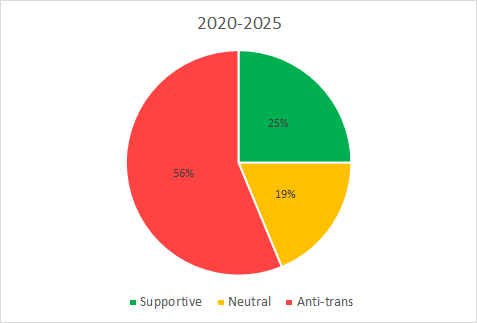

By River Champeimont, February 22nd, 2025

# CFI’s Downfall into Transphobia

_This article is about the Center for Inquiry, an American organization that, in theory, is dedicated to promoting humanism, skeptical thinking, science, and a rational worldview. It includes a small data analysis I conducted, showing how they have become increasingly anti-trans year after year._

## Context

As a trans woman, one of the hardest parts of transitioning for me was realizing that many people I once admired are transphobic, spread misinformation about us, and actively work to take away our rights.

Let’s go back to around 2006, when I was 19. I was on a trip to Scotland with my parents, and we visited a library because I wanted to buy the newly released Harry Potter book (probably *Harry Potter and the Half-Blood Prince*). But another book caught my attention—*The God Delusion* by Richard Dawkins. I already knew about Dawkins because I had recently read *The Selfish Gene* for a university biology assignment. At the time, I was an atheist with a fairly neutral view on religion, and I was immediately intrigued. I bought both books and enjoyed reading them.

Considering that the *Harry Potter* series frames the fight against purity and intolerance as a central theme, you might expect its author to stand firmly for trans rights—one of the most vilified minorities today. Similarly, you might assume that the author of a book condemning religious intolerance would be a strong advocate for LGBTQIA+ rights. But not at all! These two authors are among the most vocal opponents of trans rights [[1](https://en.wikipedia.org/wiki/Views_of_Richard_Dawkins#LGBT_issues), [2](https://en.wikipedia.org/wiki/J._K._Rowling#Transgender_people)].

See also: [My article about Dawkins’ stance](We%20are%20more%20than%20atheism.md)

## Who Will Betray Us Next?

Recently, Jerry A. Coyne—someone I used to admire as well—was involved in a controversy surrounding CFI and another similar organization, the Freedom From Religion Foundation (FFRF). He wrote a strongly anti-trans article intended for publication on FFRF’s website, as a response to an article by Kat Grant about trans women [[3](https://freethoughtnow.org/what-is-a-woman/)]. However, FFRF later removed Coyne’s article and issued an apology [[4](https://ffrf.org/news/releases/freedom-from-religion-foundation-supports-lgbtqia-plus-rights/)]. Outraged, Coyne republished the piece on CFI’s website [[5](https://secularhumanism.org/exclusive/biology-is-not-bigotry/)], where it was praised by an editor of *Free Inquiry* (CFI’s magazine) [[6](https://secularhumanism.org/exclusive/the-regrettable-dogmatism-of-ffrf/)]. Read more about the whole story here [[7](https://www.friendlyatheist.com/p/atheist-group-faces-backlash-after)].

Although I once supported CFI, I had already withdrawn my support after they published anti-trans articles in *Free Inquiry* [[8](https://secularhumanism.org/2025/01/introduction-to-special-section-on-transgender-controversies/), [9](https://secularhumanism.org/2025/01/transgender-rights-a-framework-for-resolving-the-controversy/)]. These articles echoed the same fearmongering narratives used by transphobes, without offering any proper rebuttals. While that edition did include one supportive article [[10](https://secularhumanism.org/2025/01/in-the-toilet-with-j-k-rowling-reason-vs-emotion-in-the-transgender-bathroom-debate/)], the overall impression was that CFI had positioned itself on the anti-trans side—allowing a single positive piece to create the illusion of a “balanced debate” between misinformation and actual debunking.

I will soon write an article debunking common anti-trans myths, but here, I won’t dive into countering these arguments in detail—it would take pages (Brandolini's law!).

But with the Jerry A. Coyne scandal, we enter what I would call the realm of "**hard transphobia**." _Soft transphobia_ includes statements like _“trans women should not be allowed in Olympic women’s sports”_ or _“sex is fully binary, but gender? I don’t know.”_ While harmful, these statements often stem from ignorance rather than outright malice.

_Hard transphobia_, on the other hand, involves policies and beliefs that, if implemented, would actively endanger trans people’s lives—such as _“trans women should be forced to use men’s bathrooms and locker rooms”_ or _“trans women should be placed in men’s prisons if they are convicted of a crime.”_ Jerry A. Coyne falls into this second category with his article [[5](https://secularhumanism.org/exclusive/biology-is-not-bigotry/)], and CFI not only published it but also applauded him for it [[6](https://secularhumanism.org/exclusive/the-regrettable-dogmatism-of-ffrf/)].

So I started wondering: **Has this organization always been anti-trans, and I simply didn’t notice because I didn’t identify as trans at the time? Or is this a more recent shift?**

To find out, I conducted a small data analysis. Let me spoil the conclusion right away: **This is a shift. They were not anti-trans in the past.**

## The Analysis

I searched for articles about trans issues on CFI’s blog, their magazine (*Free Inquiry*), and their public communications. I then categorized each article into three groups: **supportive, neutral, or anti-trans**.

To minimize confirmation bias, I asked ChatGPT to classify them for me. I provided the following prompt:

> I want you to tell me, for each article I copy-paste, whether it is supportive of trans people, neutral, or anti-trans.

For each article, I only provided the content—omitting the title, author, and date—to reduce the risk of bias from ChatGPT recognizing the author’s known stance.

In most cases, I agreed with ChatGPT’s classification, but there were a few instances where I disagreed (see my Excel file if you’re curious [[11](CFI_analysis/CFI%20trans%20articles%20analysis.xlsx)]). Still, I decided to use ChatGPT’s output for the analysis to avoid bias from my own perspective—even though I strongly believe it got some classifications wrong. However, its misjudgments were never between _anti-trans_ and _supportive_; they were always between _neutral_ and either _anti-trans_ or _supportive_.

Ultimately, whether you agree with my assessment or ChatGPT’s, **the overall picture remains the same—the results are nearly identical**.

So here is the evolution:

As we can clearly see, there was a **supportive era before 2020**, during which _no_ anti-trans articles were published. Then, a shift occurred, and CFI began publishing a significant number of anti-trans articles.

Another way to examine this change is by looking at the **“supportive era” before 2020**:

During this period, you would find articles like *Is There Room in Atheism for Trans People?* (2018), which expressed concern about the growing anti-trans fringe within the atheist movement [[12](https://centerforinquiry.org/blog/is_there_room_in_atheism_for_trans_people/)]. CFI also made official statements in support of trans rights [[13](https://centerforinquiry.org/press_releases/trumps_transgender_military_ban), [14](https://centerforinquiry.org/press_releases/cfi-condemns-governments-attempt-to-define-transgender-people-out-of-their-rights/)].

Then came the **anti-trans era**:

As you can see, articles promoting anti-trans views now make up a majority. If you use my categorization instead of ChatGPT’s, anti-trans articles would represent only 50%—but that’s still an alarming sign. It means there are just as many anti-trans articles as all supportive and neutral articles combined. Another way to put it: **anti-trans articles are twice as numerous as pro-trans ones**.

## My Opinion

In today’s world, being an atheist in America makes you part of an oppressed minority—not the most marginalized, but still genuinely disadvantaged. Given that, you’d expect organizations like CFI to stand in solidarity with other marginalized groups, not align with the very forces that oppress them.

Why has an organization like CFI fallen into transphobia? It seems they are betting on the “absolute free speech” approach, where allowing the spread of outright falsehoods about an already oppressed minority—without scientific backing—is considered acceptable [[7](https://www.friendlyatheist.com/p/atheist-group-faces-backlash-after)].

So what do you do if you’re trans and involved with CFI? **You leave**. You probably don’t want to be in a space where people openly advocate for policies that would lead to you being sexually assaulted [[15](https://publications.aap.org/pediatrics/article-abstract/143/6/e20182902/76816/School-Restroom-and-Locker-Room-Restrictions-and)], falling into depression, or even being driven to suicide [[16](https://www.jahonline.org/article/S1054-139X(20)30653-4/fulltext)]. And if you’re a friend or partner of a trans person, you’ll likely feel just as uneasy.

If you actually want a diverse organization where trans people feel welcome, you **set policies that limit free speech at the point where it enables the spread of harmful, false narratives that fuel hatred**. You do what the _"evil woke"_ FFRF does: **you take a stand**.

To be clear, CFI is **not** openly supporting Donald Trump’s attempts to erase trans people or make their lives miserable. They didn’t start the fire—but they sure as hell threw fuel on it.

## References
1.	https://en.wikipedia.org/wiki/Views_of_Richard_Dawkins#LGBT_issues
2.	https://en.wikipedia.org/wiki/J._K._Rowling#Transgender_people
3.	_What is a woman?_ by Kat Grant. Freedom From Religion Foundation news website https://freethoughtnow.org/what-is-a-woman/ 
4.	_Freedom From Religion Foundation supports LGBTQIA-plus rights_, Freedom From Religion Foundation main website https://ffrf.org/news/releases/freedom-from-religion-foundation-supports-lgbtqia-plus-rights/ 
5.	_Biology Is Not Bigotry_ by Jerry A. Coyne. Free Inquiry website https://secularhumanism.org/exclusive/biology-is-not-bigotry/ 
6.	_The Regrettable Dogmatism of FFRF_ by Ronald A. Lindsay. Free Inquiry website. https://secularhumanism.org/exclusive/the-regrettable-dogmatism-of-ffrf/ 
7.	_Atheist group faces backlash after publishing, then removing, anti-trans article_ by Hemant Mehta. Friendly Atheist. https://www.friendlyatheist.com/p/atheist-group-faces-backlash-after 
8.	_Introduction to Special Section on Transgender Controversies_ by Ronald A. Lindsay. Free Inquiry.	https://secularhumanism.org/2025/01/introduction-to-special-section-on-transgender-controversies/ 
9.	_Transgender Rights: A Framework for Resolving the Controversy_	by Gary L. Francione. Free Inquiry.	https://secularhumanism.org/2025/01/transgender-rights-a-framework-for-resolving-the-controversy/ 
10.	_In the Toilet with J. K. Rowling: Reason vs. Emotion in the Transgender Bathroom Debate_	by Tilda Storey-Law. Free Inquiry. https://secularhumanism.org/2025/01/in-the-toilet-with-j-k-rowling-reason-vs-emotion-in-the-transgender-bathroom-debate/ 
11. _Analysis of CFI trans-related articles_ by River Champeimont. Excel file: https://github.com/rchampeimont/transition-stories/blob/main/CFI_analysis/CFI%20trans%20articles%20analysis.xlsx 
12.	_Is There Room in Atheism for Trans People?_ by EJ Sorrell. Center for Inquiry blog https://centerforinquiry.org/blog/is_there_room_in_atheism_for_trans_people/ 
13.	_Center for Inquiry Condemns Trump’s Transgender Military Ban as Turning Back Progress_. CFI press release. https://centerforinquiry.org/press_releases/trumps_transgender_military_ban 
14.	_CFI Condemns Government’s Attempt to Define Transgender People Out of Their Rights_. CFI press release. https://centerforinquiry.org/press_releases/cfi-condemns-governments-attempt-to-define-transgender-people-out-of-their-rights/ 
15.	Gabriel R. Murchison, Madina Agénor, Sari L. Reisner, Ryan J. Watson; School Restroom and Locker Room Restrictions and Sexual Assault Risk Among Transgender Youth. Pediatrics June 2019; 143 (6): e20182902. 10.1542/peds.2018-2902 https://publications.aap.org/pediatrics/article-abstract/143/6/e20182902/76816/School-Restroom-and-Locker-Room-Restrictions-and
16.	Impact of Bathroom Discrimination on Mental Health Among Transgender and Nonbinary Youth. Price-Feeney, Myeshia et al. Journal of Adolescent Health, Volume 68, Issue 6, 1142 - 1147 https://www.jahonline.org/article/S1054-139X(20)30653-4/fulltext
