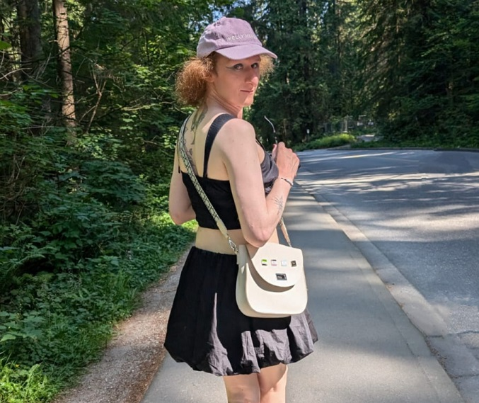

By River Champeimont, May 26th, 2024

# “Congratulations! You're a girl!”

Reflecting on my identity, I discovered I was a trans woman after all.

In my previous article, “Waking Up Non-Binary”, I shared my journey of discovering and embracing my identity as a transgender non-binary person. At that time, I was certain of my trans identity but still had lingering doubts about whether I was non-binary or a trans woman. Those doubts have now been resolved, and I've come to understand that I identify as a trans woman. Here’s how I got here.

## The Journey of Self-Discovery
It's actually common for trans people to explore several gender identities before fully understanding themselves. The path to self-discovery can be winding and complex. For me, identifying as non-binary was a significant step in my journey, but it wasn't the final destination. It provided a necessary framework that helped me explore my gender more deeply, ultimately leading me to realize I am a trans woman.

## The Stability of "Transness"
While the specific gender identity might evolve, the "transness" itself is stable. Once someone begins medically transitioning, as I have, they are very unlikely to want to detransition (see for instance this source).

## From Non-Binary to Binary
For some people, identifying as non-binary is an important step before embracing a binary gender identity. This can be because non-binary provides a more flexible space to explore gender without the pressure of conforming to the binary norms. In my case, it allowed me to navigate my gender identity without feeling boxed in by traditional definitions of male and female.

However, it’s important to emphasize that non-binary is a valid and real identity in its own right. It's not necessarily a transitional phase or a stepping stone to a binary gender identity. Many people are non-binary and remain so throughout their lives, finding fulfillment and authenticity in that identity.

## My Transition
Since coming out as non-binary, I have started my medical transition, which includes hormone replacement therapy (HRT). This journey has been affirming and transformative, helping me align my physical appearance with my gender identity. Through this process, I’ve experienced immense personal growth and self-acceptance.

The realization that I am a trans woman has brought me a profound sense of clarity and peace. It's a joyous and liberating feeling to fully understand and embrace who I am. The journey to this point has been challenging but also incredibly rewarding.

## Conclusion
Figuring out one's gender identity can be a complex and evolving process. It's okay to take time to understand yourself and explore different identities along the way. For me, identifying as non-binary was a crucial step in discovering my true self as a trans woman. I’m grateful for every part of this journey and excited for the future.

Remember, whether you are non-binary, a trans man, a trans woman, or another gender, your identity is valid. Your journey is unique, and every step you take towards understanding and embracing yourself is a step worth celebrating.

## Resources
Here I made a list of my favorite trans resources online.

### Turn me into a girl!
https://turn-me-into-a-girl.com/ - a very nice “game” that turns you into a girl if you want to. More seriously, it’s an AMAZING resource if you are questioning whether you are a trans woman. I also mentioned its non-binary equivalent in my previous article.

### YouTube channels in English
* The Chloe Connection by Chloe, a trans woman
* Spacey Aces by Elle and Kaden, two non-binary people
* Hannah Phillips, a trans woman
* Lynn Saga, a non-binary person
* Jammidodger by Jamie Raines, a trans man
  * Jamie also recently wrote an amazing book that I read: “The T in LGBT: Everything you need to know about being trans”
* ICKY, a trans woman
* Samantha Lux, a trans woman
* Sam Downey, a non-binary person
* Atlas Wylde, a non-binary person

### YouTube channels in French
* Tipoui ! by Yuffy, a trans woman
* Alistair - HParadoxæ by Alistair, a trans man
