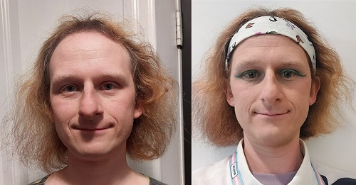

# Des nouvelles de ma transition
Par River Champeimont, 2 septembre 2024

Voici un petit article pour vous donner quelques nouvelles de ma transition.

Moi au Stonewall National Monument, New York City

## Résumé des épisodes précédents
Pour ceux qui n’aurait pas lu les articles précédents, voici un résumé rapide : Pendant les 35 premières années de ma vie, j’ai vécu ma vie en tant qu’homme, mon genre assigné à la naissance. Mais l’année dernière (2023), j’ai enfin pris conscience que j’étais une personne transgenre. J’ai tout d’abord pensé que j’étais une personne non binaire, mais toujours avec le doute que je pourrais aussi être une femme trans. Ensuite, début 2024, mes réflexions m’ont amené à réaliser que je m’identifiais « entièrement » comme une femme et que je voulais complètement socialement transitionner dans ce sens.

## Les hormones (la « HRT »)
Une des plus grandes sources de joie pour moi dans ma transition a été l’apparition progressive des différents effets causés par la HRT (Hormone Replacement Therapy, désolée pour l’anglicisme, en Amérique du Nord tout le monde utilise ce terme). Concrètement, ce sont les médicaments qui permettent de remplacer les hormones masculines dans mon corps par des hormones féminines.

Cela va peut-être sembler étrange à la plupart de mes lecteurs, mais pour moi, dès que je me suis renseignée sur les effets de la HRT, j’ai su immédiatement que je voulais absolument faire ça. Alors même que je n’étais pas sûre de si j’étais non binaire ou un femme trans, une chose était absolument certaine : je détestais l’apparence « masculine » de mon corps. Je savais que le temps jouait contre moi et que plus j’allais vieillir, plus j’allais « ressembler à un homme » et perdre mon apparence androgyne qui m’avait jusque-là permis de supporter ma dysphorie de genre.

Alors que cela ne faisait que 4 jours que j’avais accepté que j’étais non-binaire, j’ai pris le premier rendez-vous chez un médecin spécialisé pour commencer le processus pour prendre des hormones. Environ un mois plus tard, j'ai reçu un e-mail de mon médecin qui m’informait que tous mes tests étaient OK et que je pouvais commencer à prendre le traitement. La lecture de ce mail a été pour moi le moment de joie le plus intense de l’année.

Au passage, je suis vraiment désolée pour les personnes trans qui me lisent et qui pensent « comment elle a pu avoir accès à des hormones après un mois de transition seulement ? ». Je sais que je suis dans une position extrêmement privilégiée car 1. Je vis dans l’Ontario (Canada) et 2. J’ai les moyens de payer de la médecine privée (tout compris, j’ai dépensé de l’ordre de 1000 dollars canadiens).

Tous les effets causés par la HRT m’ont rendu extrêmement heureuse. Au début j’étais un peu inquiète, en me disant que peut-être qu’il y a certains effets que je n’allais pas aimer et qui allaient me mettre mal à l’aise, comme le fait de développer des seins qui est sûrement l’effet le plus radical. Au début, c’était un peu surprenant, mais aujourd’hui, quand je compare des photos de mon corps avant transition avec maintenant, je me demande comment j’ai pu accepter de ressembler à ça. J’ai maintenant plein de photos où je me trouve jolie, ce qui était exceptionnel pré-transition (à quelques exceptions près quand je m’habillais de manière très androgyne, voir la photo ci-dessous par exemple).

Une des rares photos pré-transition où j’aimais mon apparence sans en comprendre la raison.

## Les espaces genrés
La question d’utiliser les toilettes et autres espaces genrés (vestiaires par exemple) pour les personnes trans est souvent un sujet d’anxiété lors de la transition. Curieusement dans mon cas, la première fois que j’ai utilisé les toilettes pour femmes c’était en France des années avant de soupçonner que je pouvais être trans. Je m’habillais en été de manière assez féminine (dans le style de la photo ci-dessus) et une fois en allant dans les toilettes des hommes un homme m’a dit « excusez-moi, c’est les toilettes des hommes ici en fait ». Ma réaction étrange a été d’excuser et de sortir ! À ce moment je me suis dit « mince comment je vais faire ? les gens croient que je suis une femme ». Du coup j’ai été dans les toilettes des femmes et personne ne m’a fait de remarques !

Cette expérience était isolée et je ne l’ai jamais répétée, mais lors de de ma vraie transition, il y a évidemment eu le moment de changer de toilettes. En fait j’ai commencé à utiliser les toilettes des femmes vers la fin de ma « période non-binaire » peu de temps avant de commencer à m’identifier officiellement comme une femme. Au début, il y avait des remarques (bienveillantes) et des hésitations et regards étranges des autres femmes. Mais dès le moment où j’ai commencé à avoir une présentation explicitement féminine (jupes, vernis à ongles, maquillage), je n’ai plus eu aucun regard étrange.

## Des caricatures de la féminité ?
Cela m’amène d’ailleurs à une question que les personnes cisgenre posent : « Pourquoi les femmes trans sont-elle caricaturalement féminines ? Les femmes ne sont pas toutes obligées de porter des jupes, de mettre du maquillage et du vernis à ongle tout le temps ! ».

La réalité, c’est que pour les femmes trans qui transitionnent après leur puberté comme moi, notre corps a déjà été affecté de manière irrémédiable par notre puberté masculine et donc nos visages sont « analysés » intuitivement par les autres personnes comme masculins (il existe néanmoins une chirurgie lourde, la FFS, qui peut corriger ça et que certaines femmes trans font).

En gros, pour les femmes trans en début de transition comme moi, si on ne met pas de maquillage ou des habits typiquement féminins, les gens vont nous « voir » comme des hommes. Du coup, pour compenser, on est obligés d’en « faire un peu trop » par rapport à ce que les femmes cis (= non-trans) feraient habituellement. Voir par exemple les 2 photos de moi ci-dessous, avant maquillage, et après maquillage dans ma tenue de travail. Cette comparaison pourrait d’ailleurs être une expérience pour tester ma dysphorie de genre, que je ressens immédiatement de manière très forte en regardant la photo de gauche mais pas celle de droite.

Au saut du lit vs. prête à partir au travail

## Autres étapes importantes
Lors de ma transition, j’ai accompli un certain nombre de petites et grosses étapes, par exemple (en ordre chronologique) :
* Changer mon nom d’usage au travail et l’expliquer à mes collègues
* Mettre du maquillage et du vernis à ongles régulièrement
* M’habiller en robe pour la première fois au travail
* Faire mon coming out en tant que femme au travail
* Changer mon genre légal au Canada
* Faire ma première pride en tant que femme trans
* Me montrer en bikini pour la première fois à la plage
* Aller dans un spa (avec des espaces genrés) en tant que femme

Ma tenue de travail post-transition

## Étapes suivantes
Les étapes suivantes de ma transition vont probablement être :
* Faire de la chirurgie pour rendre la répartition des cheveux sur mon front plus féminine
* Terminer mon changement de nom légal au Canada
* Trouver des vêtements féminins chauds pour avoir une présentation féminine pour l’hiver
* Changer mon nom légal en France (peut-être)

J'écrirai sûrement un article pour vous donner des nouvelles par la suite. À bientôt !

PS : Si vous êtes vous-même une personne trans et/ou non-binaire, rappelez-vous que rien ne vous oblige à suivre les mêmes étapes que moi. Les éléments qui créent de la dysphorie de genre par exemple sont différents d’une personne à l’autre et vos besoins de transition peuvent donc être complètement différents des miens. Et la dysphorie de genre elle-même ne concerne pas toutes les personnes trans. Aucune des choses que j’ai citées dans ma transition n’est “obligatoire” pour toutes les femmes trans, ne vous sentez donc pas moins légitime en tant que personne trans s’il y a certaines choses dans mon histoire qui ne vous parlent pas.
