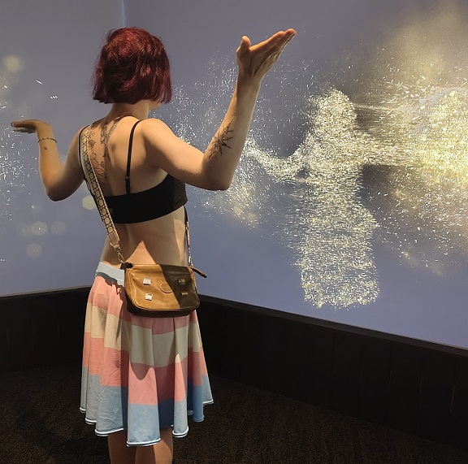
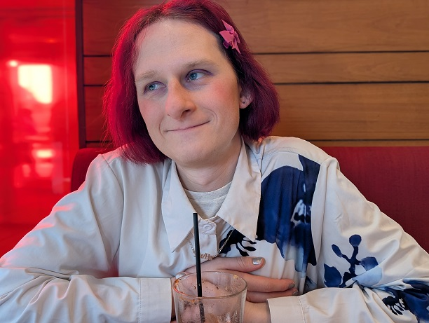
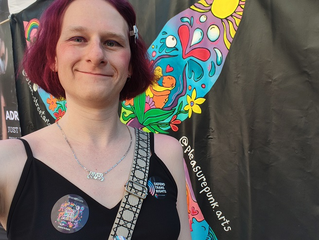
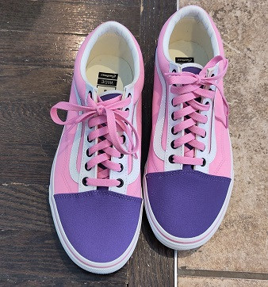

# Dressing as a Trans Woman

By River Champeimont, Jul 3rd, 2026

As a transgender woman, one of the challenges I face is how to dress. There are two main issues I faced: the need to be read as my correct gender, and the need to find clothes that fit my trans body.

## It's all about the skirts

When I was earlier in my transition, it was hard to get people to read me as my correct gender all the time. Because my face was not yet feminized by HRT and I had not undergone hairline surgery, it was sometimes ambiguous for people which gender I was.

However, I quickly found out that there was a very powerful trick, which consists in wearing clothes that are stereotypically feminine. It might seem very dumb, but as soon as I started wearing skirts instead of pants, the ratio of people who misgendered me massively dropped. Wearing pants is pretty gender-neutral in our era, however it's extremely rare to see guys wearing skirts. Therefore people just assume you're a woman if you're wearing a skirt.

The challenge was what to do in the winter though, with winter in Toronto having temperatures sometimes below -10°C / 15°F. When I reverted to wearing pants, I got misgendered again. But I found a solution, which consists in wearing a wool skirt (that I call my "underskirt") under my regular (polyester) skirt which would be what people see. The combination of the warmth of the wool and the wind-stopping effect of the polyester one made it a good outfit for walking from/to the train station.

### Tops

One of the specific challenges with tops for trans woman is we often have large shoulders, specifically for those of use who went through male puberty. Counter-intuitively, although I'm a thin woman, I have to shop sizes that are meant for plus-size women (2XL or more). This is especially surprising to people who want to buy me clothes and would assume my size would be M/L, while in fact most regular stores would not have sizes large enough for me (or just enough with their biggest available size). Cis people who would try to buy me clothes would always get it wrong.

Another note here is I don't wear t-shirts at all (they are the pants of tops!). I want all my clothes to scream femininity, and as such every piece of outfit I have has to read as typically feminine.

A "feminine" shirt I wear during winter

Of course, summer is much easier, as wearing tops that are made for breasts gives an obvious feminine presentation.

Looking feminine in the summer is easy

## Shoes

Shoes have for many years been a massive frustration for me. I always said that shoe stores have two sections, the one where I don't want to buy shoes, and the one where I can't. In the men's shoes section, I would have a average foot size. However, in the women's section, I would typically not find my size (11.5 US / 43 European).

But here is the trick I found: Both Converse and Vans allow to customize shoes, where every element's color can be selected freely. This has allowed me to make shoes that are my size and look like very stereotypically feminine.

My custom Vans

Fun fact: More than 20 people have independently complimented me on those shoes without even knowing it was a custom design made by myself. Vans should offer those as an off-the-shelf design!

### Conclusion

Finding the right outfits can be challenging as a trans woman, since we both struggle with a lack of offer on the market for our unusual bodies, and with the pressure/need to present as our true selves to avoid being misgendered. I hope the few tricks I have empirically discovered can help other trans women and raise awareness about the hidden difficulties we sometimes face.
