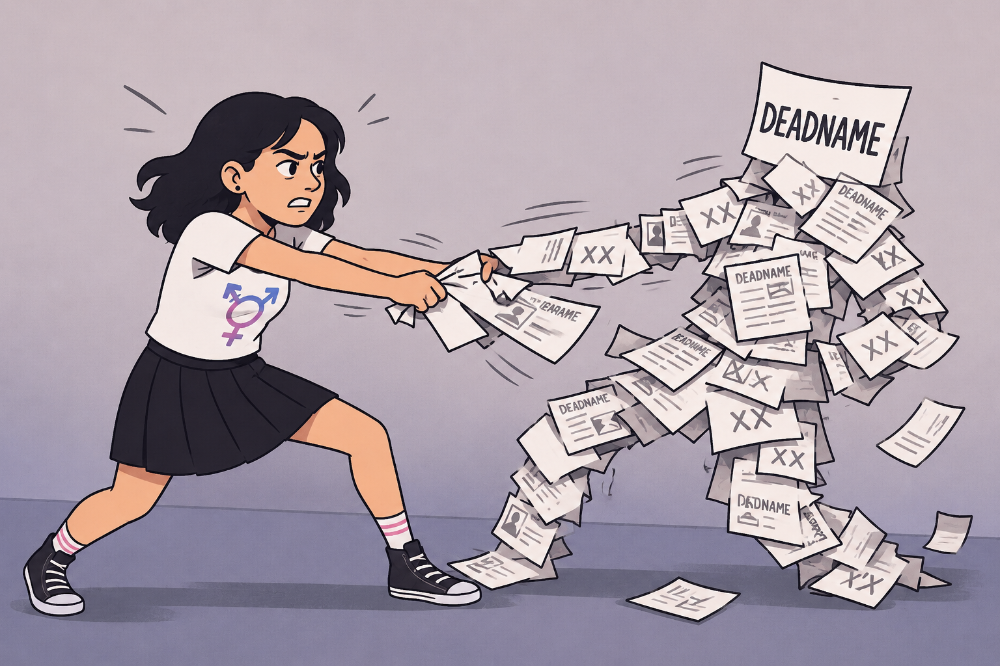
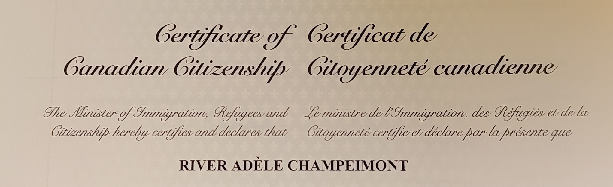

# Fighting for your name
By River Champeimont, June 1st, 2026

One of the hardest and most frustrating aspects of my gender transition
was changing my name, not because of the legal difficulty (in Ontario
it’s rather easy) but because of the dozens of places where I needed to
update it and the need to argue, call people and do paperwork. Even
though I officially changed my name in 2024, I’m still fighting to
change it in some places.

For me, as for many trans people, seeing my deadname is distressing. It
makes me feel gender dysphoria because my deadname is associated with
the wrong gender. I therefore experience the same feeling of disgust
that I experience when I’m misgendered.

I went to great lengths to change my name everywhere, and I counted 60+
places where it is not tied to my legal name and is purely a preferred
name. The hard part is when the name you provide must be your legal
name. These require a lot of administrative interactions because you
need to prove your legal name change. I counted 22 of these.

## Citizenship

But first, let me start with a piece of big news since my last article
on this blog: I became a Canadian citizen!

When applying for citizenship, there are some additional documents which
allow you to request the citizenship certificate directly with your new
name and gender, even if you emigrated under your deadname and incorrect
gender. On the day of the citizenship ceremony, I was therefore given
the certificate below with my correct name and gender!

This means a lot to me, because it allows me to finally have a passport
with my true gender and name!

Until now, when flying internationally, I had to use my French passport,
and since the procedure to change my name is still not finished in
France (and is much harder than in Ontario), it resulted in me being
deadnamed and misgendered when booking tickets and flying.

For instance, the email below reads “Dear Mrs. River Champeimont, your
flight tickets are attached”. Until I got my Canadian passport, I got
misgendered and deadnamed in those.

## Successes

In a lot of places, people agreed to change my name provided I show
legal proof.

When it comes to public administrations, I did driver’s license, health
card, vehicle permit (these first 3 all at the same time), SIN record
(online), CRA (simple call).

When it comes to businesses, it worked rather well with many like RBC,
Paypal, Alectra utilities (the electricity utility where I live), and
Flying Blue.

In some places, I was able to change my name, but I needed to insist a
lot. For instance, I had to do the procedure 3 times with Aéroplan (Air
Canada’s frequent flyer program), contrary to their competitor Flying
Blue (Air France’s) which made the change immediately.

## Radical measures

What is really annoying is when businesses can’t change your name
properly everywhere. For instance, they change it in one place, but it
does not propagate everywhere and you continue to see your deadname
popping up in places.

For instance, Wise (an international bank) allowed me to change my
deadname, but would not change it in Interac nor in the “Wisetag” (some
kind of unique ID to send money to other customers). Also, they have a
preferred name feature but it’s a scam! It does not show the preferred
name anywhere, not even in the app in the profile page. I find it deeply
disrespectful for the trans community to offer a fake feature like that.

Similarly, Bell Canada changed my name on invoices but continued to
email me at my deadname email even though I had changed it everywhere.

Also, my insurance company did not update my name when I emailed them.

For me, it was unacceptable having my deadname stay forever in some
places, so I closed the accounts and switched to other providers for the
same services. It seems like a radical solution, but it’s entirely worth
it in my case because I get the peace of mind that the new service is
never going to deadname me, since they never even knew my old name.
That’s why, for all the services above, I switched to competitors (Wise
to Amex, Bell to Telus, Aaxel to Desjardins).

## When you’re trapped

On the other hand, there are cases where you can’t just close the
service. I had intense frustration with credit bureaus in Canada,
Equifax and TransUnion. They are private companies but in practice an
oligopoly, and it’s impossible to opt out of their services.

Equifax agreed to change my name and updated my credit report in 2025,
but when I had the idea to check my credit report in 2026, I discovered
that they had reverted to my deadname! My correct name just appears in
the AKA field as a secondary name, but the full name as well as the
title of the report are my deadname again!

Just as bad, their competitor TransUnion straight up refused to update
my name in 2025, arguing that my correct name already appears in the
“AKA” section. So they seem to think it’s fine that my deadname is the
name in “full name” and as the title of the report…

Credit bureaus are the worst of both worlds. When it comes to public
administrations, things are slow but at least they honor my legal right
to change my name. When it comes to private companies, I can just end
the service if they refuse to change my name. But credit bureaus are an
oligopoly and there is no way to “close the account”, but they don’t
respect my rights as public institutions generally would in Canada (like
ServiceOntario, IRCC, the CRA, etc.)

## My scientific legacy

Finally, I’m trying to change my name on my scientific articles, and I
emailed every journal I have published in. So far, only 2 out of the 7
have answered and changed my name, and I was also able to change it on
my PhD manuscript:

- [Genetic mutations
  combinatorics.](https://theses.hal.science/tel-01118660) Université
  Pierre et Marie Curie - Paris VI, **2014**.

- Lorenzo Cassi, River Champeimont, Wilfriedo Mescheba, Elisabeth de
  Turckheim. [Analysing Institutions Interdisciplinarity by Extensive
  Use of Rao-Stirling Diversity
  Index.](https://journals.plos.org/plosone/article?id=10.1371/journal.pone.0170296)
  PLoS ONE, **2017**, 12 (1), pp.1-21.

- Christophe Leplat, River Champeimont, Panatda Saenkham, Corinne
  Cassier-Chauvat, Jean-Christophe Aude, et al. [Genome-wide
  transcriptome analysis of hydrogen production in the cyanobacterium
  Synechocystis: Towards the identification of new
  players.](https://www.sciencedirect.com/science/article/pii/S0360319912026079) International
  Journal of Hydrogen Energy, **2013**, 38 (4), pp.1866-1872.

## Tricks

When there is no way to change my name in some places, for instance
France’s tax website (since my legal name is not changed in France yet),
I use a browser extension that visually replaces my deadname by my
correct name.

In my emails, I added a filter to flag emails containing my deadname
with a red “deadname” label to warn me (as a trigger warning basically),
and also because it helps find the places where I need to change my
name.

## Trans joy

Sometimes the joy comes from subscribing to new services or
organizations and having your true name from the start, with no fear
that somewhere in their system your deadname still hides and will
suddenly appear. I discovered that I quite like seeing my name in places
because I feel celebrated as my true self, while in the past I was
trying to hide myself because I would be celebrated as a fake version of
me (for instance I never went to my PhD graduation ceremony).

## Next steps

My next steps are probably going to be changing my name in France in
various places, fighting again with the credit bureaus, and trying to
get my scientific publications updated. Stay tuned!
