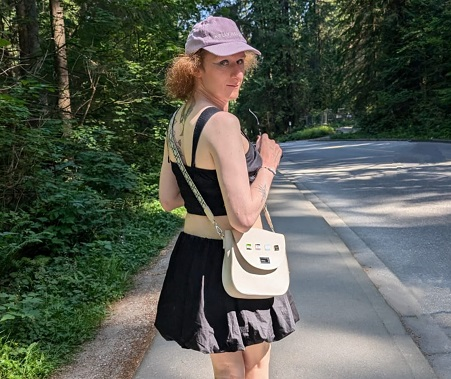

# L’histoire de River

Par River Champeimont, 31 mars 2025

![Une illustration vibrante centrée autour des mots « TRANSGENDER LIFE » en lettres majuscules blanches avec un contour bleu foncé. L’arrière-plan reprend les couleurs du drapeau transgenre : bleu clair en haut et en bas, rose clair au-dessus et en dessous d’une bande blanche centrale. Autour du texte, une composition florale colorée présente des fleurs aux tons rose, blanc et bleu, accompagnées de feuilles élégantes. Plusieurs papillons aux ailes multicolores voltigent dans l’image, évoquant la liberté et la légèreté. Des étoiles scintillantes et des cercles diffus ajoutent une ambiance magique et optimiste à l’ensemble.](TDOV2025/transgender_life_small.png)

Si vous ne lisez qu’un seul article sur ma transition, lisez celui-ci !

Il s’agit d’un article que j’ai écrit pour l’Intranet de RBC (où je
travaille) à l’occasion du *Transgender Day of Visibility (Journée
internationale de visibilité transgenre)*. J’ai juste supprimé les
quelques phrases qui révélaient des informations internes à
l’entreprise.

Être trans est quelque chose qu’on découvre à propos de soi-même, et qui
est souvent un processus difficile. On pourrait comparer cela à avoir le
« logiciel » d’un genre installé sur le « matériel » d’un autre genre.

Mon nom est River et je suis une femme transgenre.

# Avant l’éclosion

*Dans la communauté trans, les gens parlent « d’œufs » pour les
personnes qui n’ont pas encore réalisé qu’elles étaient trans, avant
qu’elles « cassent leur œuf ».*

Remontons le temps. Avant de déménager au Canada, j’ai vécu toute ma vie
en France, près de Paris.

Les premiers signes de ma transidentité remontent à quand j’étais
enfant. J’ai dit à un copain à l’école que « j’aimerais bien être une
fille ». À l’époque, les garçons se sont moqués de moi, et je n’ai
jamais osé redire ce genre de chose.

Plus tard dans ma vie, en particulier après être devenue une adulte
indépendante, j’ai toujours ressenti ce besoin d’apparaître comme plus
féminine. Je portais toujours des vêtements achetés dans la section
femme, mais jamais rien de trop explicitement féminin comme des jupes
car cela me semblait socialement inacceptable « pour un homme ».
Pourtant pendant l’été, ma façon de m’habiller était tellement féminine
que les gens m’appelaient « madame » dans les commerces. Je ne
corrigeais jamais les gens car en fait ça me plaisait. Mais aussi
bizarre que cela puisse paraître, je ne me considérais pas comme trans
pour autant. Je n’avais même pas de mot pour décrire ce que c’était, je
disais simplement que j’étais « juste originale » si on me demandait. En
fait, je ne connaissais pas grand-chose au concept de transidentité. Je
connaissais bien une personne trans, mais je n’imaginais pas une seule
seconde que cela pourrait également être mon cas.

Un jour, des amies ont proposé de me mettre du maquillage pour me faire
ressembler à une femme, juste pour s’amuser une après-midi. Elles
pensaient que ça me ferait plaisir, et j’ai en effet immédiatement
accepté ! On a alors réalisé ce projet un week-end. J’ai adoré mon
apparence et j’ai dit « je sais exactement quoi porter avec pour prendre
des photos ». J’ai enfilé une jupe noire en jean et une chemise sans
manches. Personne n’a demandé pourquoi j’avais ces vêtements sous la
main. Nous étions juste toutes heureuses. J’ai adoré les photos qu’on a
prises et les ai postées sur les réseaux sociaux. Mes parents ont eu
peur que je reçoive des commentaires négatifs, mais tout s’est bien
passé. Quand je repense à ce jour, je me dis que c’était un essai
gratuit d'un jour pour ma future transition.

Mais la vie a continué. J’étais concentrée à 100% sur le développement
de ma start-up, et je n’avais pas le temps de réfléchir à mon identité.
J’avais pourtant une apparence très androgyne dans la vie de tous les
jours, avec des vêtements féminins, des cheveux longs, rasée de très
près, et je profitais ce chaque soirée déguisée pour m’habiller de
manière totalement féminine. Ma non-conformité de genre était quelque
chose d'accepté et de connu par tous, même si on ne mettait pas de mots
dessus.

# Le déménagement au Canada

Par la suite, j’ai immigré au Canada. Il a fallu que j’ouvre un compte
en banque, que j’obtienne un permis de conduire local, que je trouve un
logement, un travail… J’ai intuitivement pensé que je devais cacher le
« côté trans » de ma personne pour « avoir l’air normale ». Je me suis
donc habillée de manière masculine et ennuyeuse. Mais le week-end, je
rencontrais des personnes passionnantes de la communauté LGBTQIA+ de
Toronto, et je me suis rendue compte que ce nouvel environnement était
encore plus ouvert d’esprit que celui de Paris. J’ai commencé à porter
des jupes en public en dehors du travail (ce que je n’avais jamais osé
en France), et les gens semblaient totalement l’accepter. Et je me suis
remise à me teindre les cheveux. En France, j’avais essayé presque
toutes les couleurs de cheveux possibles, le violet étant ma préférée.

Mais quelque chose n’allait pas. Je vieillissais et mon corps devenait
de moins en moins androgyne, par exemple la frontière des cheveux sur
mon front était plus haute et de manière générale mes cheveux se
raréfiaient. Par conséquent, mon apparence devenait de plus en plus
masculine et je détestais ça, mais je ne comprenais pas que c’était ça
le problème. Je ressentais juste un profond mal-être.

Dans la communauté LGBTQIA+ locale, j’ai rencontré des personnes
non-binaires. Je n’avais aucune idée qu’un tel concept existait quand je
vivais en France. Cela a ouvert une nouvelle possibilité pour moi.
Peut-être étais-je comme iels ? J’ai commencé à me renseigner. L’étape
finale a été d’aller sur le site « [*<u>Turn me into a non-binary
person</u>*](https://euphorbia-milli.notion.site/euphorbia-milli/Turn-Me-Into-A-Non-Binary-Person-4710c60a76a54347932fca656fb602dc) »
(transforme-moi en personne non binaire) qui explique ce que les
personnes non-binaires ressentent. Je me suis reconnue dans ce qui y
était écrit, et ça a été une telle révélation que j'ai pleuré de joie.

Aujourd’hui, je sais que je ne suis en fait pas une personne
non-binaire, mais une femme trans. Par contre, une chose dont j’étais
sûre dès le début était que je voulais de la « HRT » (comme on dit en
Ontario).

# Transition

La HRT est le processus consistant à prendre des médicaments pour
remplacer les hormones que notre corps produit par celles qui
correspondent à notre identité de genre. C’est comme « inverser » sa
biologie interne. Dans mon cas, cela me donnerait la possibilité de
féminiser mon apparence. Je pouvais arrêter le masculinisation
« naturelle » de mon corps, et je voulais que cela commence le plus vite
possible. Deux mois plus tard, quand j’ai reçu un SMS de mon médecin me
donnant son accord pour commencer le traitement, j’ai été me cacher dans
une salle de réunion pour pleurer de joie.

Plus tard dans ma transition, j’ai décidé de changer mon nom (en River
comme vous pouvez vous en douter). J’ai [annoncé mon nouveau
nom](I’m%20changing%20my%20name.md) lors du
*Transgender Day of Visibility*.

Je suis reconnaissante envers RBC de m’avoir permis de changer mon nom
(et mon adresse email) dans tous les systèmes internes alors même que ce
n’était pas mon nom légal. \[…\] J’ai aussi envoyé un email à mon équipe
expliquant que je changeais mon nom pour mieux correspondre à mon
identité de genre. Mon manager et mon équipe m’ont immédiatement
soutenue et ont tout de suite commencé à utiliser mon nouveau nom.

Et pour finir j’ai fait mon dernier coming out quelques mois plus tard,
j’ai expliqué que j’étais une femme trans et que j’utiliserai maintenant
les pronoms féminins *she/her* \[…\]. C’était mon second coming out car
j’avais initialement annoncé que je m’identifiais comme non-binaire (et
que j’utilisais les pronoms *they/them*).

# Libération

Avec le temps, les effets des hormones ont commencé à être visibles sur
mon corps. Pour la première fois de ma vie, j'ai pu me dire en regardant
dans le miroir que j'aimais mon reflet. Pour être honnête, ce n’est pas
uniquement grâce aux hormones, j’ai aussi fait de la chirurgie
d’implantation de cheveux, de l’épilation laser et de l’électrolyse.

Maintenant, je ne suis plus angoissée à l’idée de vieillir. Je connais
plusieurs femmes trans âgées, et cela ne me dérange pas de savoir qu’un
jour je serai comme elles. Je préfère largement ça à mon apparence
pré-transition, même si j’étais bien plus jeune.

En plus d’aimer mon apparence, être vue avec le genre correct par les
autres personnes me rend très heureuse. Dans mon cas, c’est comme une
sensation de soulagement et de paix, à l’opposé de la sensation de
« tension » que je ressentais quand les gens parlaient de moi au
masculin avant.

Ces temps-ci, le monde semble devenir plus intolérant envers les
personnes trans, et transitionner implique du stress, du travail et
parfois de la douleur physique, mais si vous me demandiez si ça vaut le
coup, je vous dirais : *Oui, absolument !*
