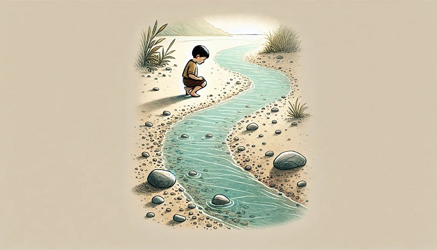
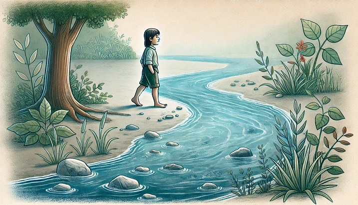

# La rivière

Par River Champeimont, le 16 novembre 2024

Ceci est un micro-article qui explique une autre raison pour laquelle j'ai choisi le nom River.

Chaque jour de ta vie, tu as marché un peu plus loin le long de la rivière, dans le sens du courant.

Tu étais toujours curieuse de ce qu'il y avait de l'autre côté.

Ça aurait été facile de traverser au début, car ce n'était qu'un ruisseau alors, mais on t'a dit que c'était interdit et que personne ne faisait jamais ça.

Alors tu as continué à marcher le long de la rivière pendant des années. Et un jour, tu te rends compte qu'en fait tu es du mauvais côté.

Tu regardes la rivière, mais c'est maintenant devenu un fleuve.

Mais tu décides de traverser quand même. C'était difficile mais tu arrives de l'autre côté.

Et maintenant tu vis de l'autre côté, et tu es heureuse.

