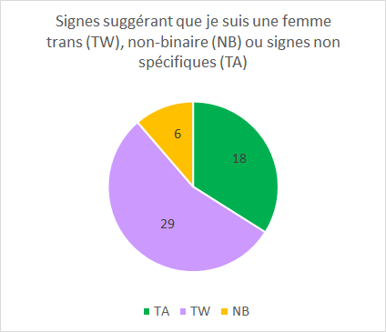

# Les signes que je suis trans : une analyse des données

Par River Champeimont, 21 décembre 2024

En repensant à ma vie, je réalise qu'il y avait d'innombrables signes qui indiquaient que j'étais transgenre. Certains étaient subtils, d'autres plus évidents avec le recul. Pourtant, pendant une grande partie de ma vie, je les ai soit ignorés, soit rationalisés. Maintenant qu'il est évident pour moi que je suis une femme trans, je me rends compte du nombre hallucinant d'indices et de détails qui auraient dû rendre tout ça clair, même si c'est facile de se dire ça a posteriori. Voici quelques réflexions sur ce que j’ai découvert.

## De la rationalisation à la réalisation

Pendant une grande partie de ma vie, j'ai rationalisé ces signes en me disant des choses comme : « J’aime juste les esthétiques féminines » ou « C’est normal d’envier les apparences androgynes ». Malgré tout, les preuves continuaient de s'accumuler, et j'ai appliqué ici le rasoir d’Occam : tous ces faits mis ensemble n'avaient de sens que si j'étais une femme trans.

Un jour, nous étions dans un centre commercial avec ma femme, qui m'a dit qu'elle avait entendu un inconnu dire à son pote, en me regardant : « Mec, regarde comment elle est trop bonne ». Je ne l’ai pas entendu moi-même, mais ma femme me l'a dit en sachant que cela me ferait plaisir (même si on m'avait « confondu » avec une femme à l'époque alors que je ne m'identifiais pas comme tel).

Un autre moment marquant fut lorsque j’ai acheté une jupe la veille de Noël, avec l’intention de ne la porter qu’en privé. Je me souviens que c'était très agréable ne serait-ce que de la tenir en main, mais aussi de la peur à l’idée d’être « découverte », de me sentir surexcitée malgré la sensation d'interdit. Même si c'était en cachette, la porter me faisait très plaisir.

Je me souviens aussi d'épisodes de mon enfance, comme le jour où j’ai fabriqué une jupe en ruban adhésif (duct tape). Ce n’était pas pour me sentir jolie — je n'avais aucune idée de ce que je faisais à l’époque. J'avais simplement envie de le faire, pour le plaisir de la fabriquer et de la porter, même si j’ai rapidement détruit les « preuves » par la suite.

Lorsque j’ai commencé à me colorer les cheveux, ça m'a donné une sensation de liberté et de contrôle sur la façon dont les gens me percevaient. Cela me permettait de modifier mon apparence (de la féminiser, même si je ne l'aurais pas formulé ainsi à l'époque) de manière socialement acceptée. J’ai essayé des couleurs flashy et pétantes, et chaque compliment que je recevais semblait valider une partie de moi qui commençait tout juste à émerger.

## Un regard quantitatif sur les signes

Après avoir réalisé que j’étais trans, j’ai progressivement catalogué 53 signes qui semblaient indiquer que j'étais une personne trans. En les analysant, je les ai classés comme indicatifs d’être une femme trans (TW), non-binaire* (NB), ou plus généralement trans (TA), mais sans être assez précis pour suggérer l'un ou l'autre.

***Non-binaire** décrit une personne dont l'identité de genre n'est ni strictement masculine ou féminine. Cela fait partie du spectre transgenre, mais ce n'est pas la même chose qu'être un homme trans ou une femme trans.

Voici la répartition des signes :
* **29 signes** suggéraient que j'étais une femme trans (TW)
* **18 signes** indiquaient que je faisais globalement partie du spectre transgenre (TA)
* **6 signes** étaient plus alignés avec une identité non binaire (NB)

Bien que certains signes aient pu indiquer une identité non binaire (6), on peut constater que la majorité des données (29) pointaient vers le fait que je suis une femme trans. En analysant ces données, il m’a été beaucoup plus facile de surmonter mon syndrome de l’imposteur et de prendre confiance en mon identité de genre.

## Les signes au fil du temps

En répertoriant ces données, j’ai été fascinée de voir qu'elles s'étalaient sur une très longue période, commençant bien avant que je ne découvre que j'étais trans, et même avant que je sache que ça existait. De ce souvenir à l'école primaire où je disais déjà vouloir être une fille, jusqu'à ma fascination pour l'effet des hormones (HRT) qui m'a poussée à commencer à en prendre, il s'est écoulé littéralement des décennies.

![L’histogramme illustre la répartition de 53 signes dans le temps, de 1988 à 2023. L’axe des x représente les années, tandis que l’axe des y montre le nombre de signes identifiés par année. Les barres sont codées par couleur pour représenter trois catégories : vert pour les signes généraux (TA), violet pour ceux pointant vers une femme trans (TW), et jaune pour ceux suggérant une identité non binaire (NB). Des regroupements clés apparaissent entre 2015 et 2023, reflétant des moments intenses de découverte de soi et d’exploration de l’identité.](trans_signs/histogramme.png)

On peut clairement voir le moment où j'ai commencé à remettre activement en question mon identité de genre passé la trentaine et comment cette exploration a progressivement mené à une meilleure compréhension de moi-même.

## Accepter ma vérité

Chacune de ces « données » est bien plus qu'un point sur une courbe ou un graphique. Bien que ça m'ait pris des décennies pour m'en rendre compte, chacune de ces expériences était une étape nécessaire pour découvrir qui je suis vraiment et pour vivre aujourd'hui en tant que femme trans épanouie. À l'époque, je n'avais pas conscience que ces signes étaient liés à ma transidentité, mais ils ont pris tout leur sens avec le recul.

Je me rends compte aujourd'hui que beaucoup de femmes trans partagent des expériences très similaires, parfois identiques aux miennes. Se comprendre n'est pas toujours un chemin linéaire, mais chaque étape compte.

Si vous vous questionnez sur votre propre identité de genre, sentez-vous libre d'expérimenter, de tester et de vous tromper. Vos expériences et vos ressentis sont valides. Faites attention aux petits détails : ils pourraient bien finir par prendre tout leur sens et vous mener vers votre propre vérité.
