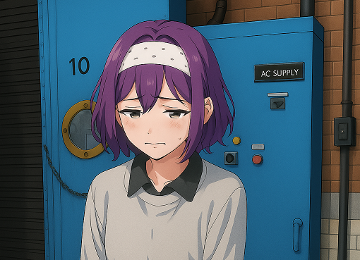

# My biggest transition mistake

River Champeimont, June 24th, 2025

I don’t have many regrets related to my transition, except a specific
one about my legal name change.

## Irreversible changes

I made a lot of irreversible transition choices, some small and some
big. Strangely, my first one dates back from long before my “official”
transition. I had dozens of laser hair removal sessions on my legs and
chest in France, years before suspecting I was trans. I just “felt” I
wanted my body to look less masculine. The legs' hair removal was a huge
success (my legs look smooth now), the chest hair grew back but went
away after taking HRT.

By the way, I know that cis women have hair on their legs too (although
less than men on average), but we trans women have so many aspects of
our body that look too masculine that we often want to compensate for
them.

Then, just one year before realising I was trans, I felt a stronger push
to feminise my body, and in addition to dyeing my hair in purple again,
I got several cute tattoos. Now we are talking about serious
irreversible changes here!

A tattoo I got to make my appearance cuter and more feminine

So, I committed to irreversible changes long even before realising I was
transitioning. People often think of HRT (hormones) as the first
irreversible choice in transition. In reality, breast growth is really
the single irreversible effect of HRT that would stay even if I stopped
taking it. Breasts don’t un-grow (trans men wish they did!) when going
off estrogen, but fat redistribution and hair growth would slowly revert
on the other hand.

## What about my name change then?

Here I had a “happy accident” and an unhappy one with the same root
cause.

When I decided to change my name, I still identified as non-binary, and
I had not understood yet that I was a trans woman. I therefore looked
for a name that was gender-neutral. I looked for popular non-binary
names, among which you have names like Ash, Sage, Atlas, Quinn… and
River. "River” specifically resonated with me ([see my previous
article about my name
change](I’m%20changing%20my%20name.md)). I
have since heard about 4 other non-binary people with the name River, so
it’s a pretty popular name in the trans/enby community.

So that’s the happy accident. Because I identified as non-binary, I
allowed myself to choose a completely different name from my birth name,
instead of feeling the pressure to just feminise my birth name for
simplicity.

Even though I don’t identify as non-binary anymore, I really like the
name River, it has several special meanings to me, and it “feels like
me”.

So what’s the problem then? The problem is when I changed my legal name,
I had to choose what to do with my middle name. My previous middle name
was a masculine name that basically nobody heard about, because in
France middle names don’t appear anywhere other than on ID (and you can
have several in fact, like second name, third name, fourth name…). I had
no imagination to create a new middle name, so I thought: Since it will
be hard or perhaps infeasible to change my name in France, let’s make it
less confusing, in case I have documents from both countries with the
old and new legal names…

So, I had this terrible idea: **Let my middle name be my deadname!**

## What’s wrong about it?

I think that because the bank's clerk who opened my account was also an
immigrant, they did not record my middle name as part of my full name.
So I was under the illusion that middle names did not matter much in
Canada either. Also, I did not really notice when it appeared because my
middle name would not strike me as strange back then.

My legal name change took a total of 5 months, and by the time I got the
certificate, I had already realised I was a woman; but it was too late.
I then did all the necessary follow-up changes, IDs, bank account, etc.
which propagated the change everywhere.

However, the problem soon became clearly apparent. River is a
gender-neutral name, so if people refer to me as “River \[deadname\]
Champeimont”, it feels overall like a masculine name.

Also, now that I identify as a woman, it feels deeply wrong to have my
masculine deadname show up everywhere. I did not realise it when I was
earlier in my transition because at the time my deadname still felt like
it was me, which is not the case anymore after one year of using my new
name River.

Now I have “River \[deadname\] Champeimont” written on my credit card,
all emails from banks start with “Hi River \[deadname\]” and on the
phone I’m sometimes asked “Is it River \[deadname\]?”.

What feels especially annoying to me is it feels like it disambiguates
whether River is feminine/masculine/non-binary in the wrong direction,
like if it was “Hello River - masculine version”.

## What am I going to do about it?

Overall, I feel deeply frustrated about having my deadname appended to
my new name everywhere like this, so here is what I’m going to do about
it: I’m filing another legal name change to change my middle name only.

I asked my parents what name they would have given me if I was assigned
female at birth. This name is **Adèle**. I really like that name and it
feels like a name that could be mine.

That’s why I filed a new name change so that my legal name becomes
“River Adèle Champeimont”. I hope it works!

In conclusion, don’t get the impression that I’m frustrated with my
transition because of this issue. Although I regret this specific point,
overall most of my transition steps have been a success, and my quality
of life has massively improved with transitioning. Now that I’ve lived
in the post-transition world, I can’t imagine going back to my previous
life! And the good thing is this mistake is not an irreversible one.

So see you soon with I hope news of success!
