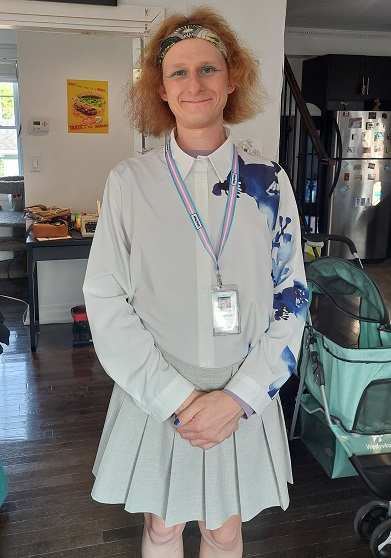

By River Champeimont, September 3rd, 2024

# News about my transition
Here is a short article to give you some news about my transition.

Me at the Stonewall National Monument, New York City

## Summary of previous episodes
For those who haven't read my previous articles, here's a quick summary: For the first 35 years of my life, I lived my life as a man, my gender assigned at birth. But last year (2023), I finally realized that I am transgender. I first thought I was non-binary, but always thought that I might be a trans woman instead. Then, in early 2024, my thoughts led me to realize that I “fully” identified as a woman and wanted to completely socially transition in this direction.

## HRT
One of the greatest sources of joy in my transition was the gradual onset of the various effects caused by HRT (Hormone Replacement Therapy). Concretely, these are the medications that allow the male hormones in my body to be replaced by female hormones.

This may seem strange to most of my readers, but for me, as soon as I learned about the effects of HRT, I knew immediately that I absolutely wanted to do this. Even though I wasn't sure if I was non-binary or a trans woman, one thing was absolutely certain: I hated the “masculine” appearance of my body. I knew that time was against me and that the older I got, the more I would “look like a man” and lose my androgynous appearance that had, until then, allowed me to tolerate my gender dysphoria.

When it had only been 4 days since I accepted that I was non-binary, I made the first appointment with a specialist doctor to begin the process of taking hormones. About a month later, I received an email from my doctor informing me that all my tests were OK and that I could start taking the treatment. Reading this email was for me the most intense moment of joy of the year.

By the way, I'm really sorry for the trans people reading this who are thinking “how did she get access to hormones after only one month of transitioning?”. I know that I am in an extremely privileged position because 1. I live in Ontario (Canada) and 2. I can afford private medicine (all included, I spent around 1,000 Canadian dollars).

All the effects caused by HRT made me extremely happy. At first I was a little worried, thinking that maybe there were certain effects that I wouldn't like and that would make me uncomfortable, like developing breasts (which is surely the most radical effect). At first it was a little surprising, but today, when I compare pictures of my body pre-transition and now, I wonder how I could tolerate to look like that back then. I now have plenty of pictures where I feel I look good, which was exceptional before transition (with a few exceptions when I dressed very androgynously, see the picture below for example).

One of the rare pre-transition pictures where I liked the way I looked without understanding why.

## Gendered spaces
The question of using bathrooms and other gendered spaces (locker rooms for example) for trans people is often a subject of anxiety during transition. Oddly enough in my case, the first time I used the women's bathrooms was in France years before I suspected I might be trans. I dressed quite femininely in the summer (in the style of the picture above) and once when going to the men's bathrooms a man said to me “excuse me, this is the men's bathroom.” My strange reaction was to apologize and walk out! At that moment I said to myself “what am I going to do? People think I’m a woman.” So I went to the women’s bathroom and no one made any comments!

This experience was isolated and I never repeated it, but during my real transition, there was obviously the moment to change bathrooms. I actually started using the women’s bathrooms towards the end of my “non-binary period” shortly before I started officially identifying as a woman. At first, there were (kind) remarks and hesitations and strange looks from the other women. But from the moment I started to have an explicitly feminine presentation (skirts, nail polish, makeup), I no longer had any strange looks.

## Caricatures of femininity?
This also brings me to a question that cisgender (= non-trans) people ask: “Why are trans women caricatures of femininity? Women don’t have to wear skirts, makeup and nail polish all the time!”.

The reality is that for trans women who transition after puberty like me, our bodies have already been irreparably affected by our male puberty and therefore our faces are intuitively “analyzed” by other people as masculine (there is a major surgery though, FFS, which can correct this and which some trans women do).

Basically, for trans women at the beginning of their transition like me, if we don't wear makeup or typically feminine clothes, people will “see” us as men. As a result, to compensate, we are forced to “do a little too much” compared to what cisgender women would usually do. See for example the 2 photos of me below, before makeup, and after makeup in my work outfit. This comparison could also be an experiment to test my gender dysphoria, which I immediately feel very strongly when looking at the picture on the left but not the one on the right.

Getting out of bed vs. ready to go to work

## Other important steps
* During my transition, I accomplished a number of small and big steps, for example (in chronological order):
* Change my name at work and explain it to my colleagues
* Apply makeup and nail polish regularly
* Wear a dress for the first time at work
* Do my coming out as a woman at work
* Change my legal gender in Canada
* March at my first pride as a trans woman
* Show myself in bikini for the first time at the beach
* Going to a spa (with gendered spaces) as a woman

My post-transition work outfit

## Next steps
The next steps in my transition will likely be:
* Have surgery to make my hairline more feminine
* Complete my legal name change in Canada
* Find warm female clothes to have a feminine presentation for winter
* Change my legal name in France (maybe)

I will probably write an article to give you news afterwards. See you soon!

PS: If you are a trans and/or non-binary person yourself, remember that nothing requires you to follow the same steps as me. The elements that create gender dysphoria, for instance, are different from one person to another and your transition needs may therefore be completely different from mine. And gender dysphoria itself does not affect all trans people. None of the things I've mentioned about my transition are “required” for all trans women, so don't feel less valid as a trans person if there are certain things in my story that don't resonate with you.
