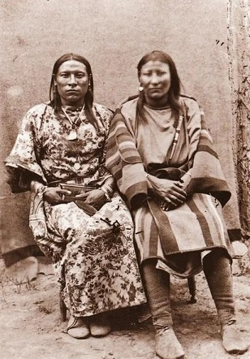
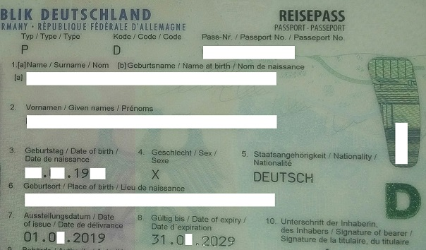

# Que veulent les personnes trans ?

River Champeimont, 27 septembre 2025

Ici je vous parle de l’importance de la transition légale pour les
personnes trans !

## Les premières nations l’ont fait avant nous

Les navajos avaient un rituel de transition pour les femmes trans. Lors
d’une cérémonie spécifique, la femme trans\* se mettait à danser dans un
cercle devant les autres membres de la tribu. Elle quittait ensuite le
cercle, enfilait des habits féminins, puis revenait dans le cercle avec
ses nouveaux vêtements. Elle annonçait alors son nouveau nom féminin et
dansait à nouveau. À partir de là elle était considérée comme une femme,
et ce malgré l’absence d’hormones féminisantes ou de chirurgie génitale
\[1, 2\].

Osh-Tisch (à gauche), une femme trans\* du peule des Crows (corbeaux),
état reconnue par sa tribu comme une femme et ses exploits guerriers
rendaient fières les autres femmes de la tribu qui la considéraient
comme l’une des leurs \[2\].

## Du chemin à faire pour l’Occident

Les occidentaux mettront des siècles avant d’atteindre ce niveau
d’inclusion. Et encore aujourd’hui, une grande partie des pays
occidentaux requièrent des transformations médicales voire de la
chirurgie pour autoriser un changement de genre légal. Même dans l’Union
Européenne, seule une minorité de pays autorisent un changement de genre
légal sans procédures médicales \[3\]. Et même dans ce cas, les
procédures de changement de nom et de genre peuvent rester très
complexes, comme celle que je suis en train de faire en France (un
dossier à monter avec un avocat, avec des dizaines de preuves à
collecter).

Il faut bien comprendre que le choix pour une personne trans de faire de
la chirurgie génitale dépend complètement de ses besoins personnels.
Dans la communauté trans, les personnes ne sont pas considérées
différemment selon si elles ont fait ou non cette chirurgie (d’ailleurs
c’est une information totalement privée, il est malvenu de poser la
question si vous n’êtes pas super proche de la personne !).

Le critère légal basé sur la chirurgie génitale est aussi absurde que si
je proposais que le critère pour avoir le droit d’être considérée comme
une femme était d’avoir une répartition de cheveux féminine, qui
correspond à la chirurgie que j’ai faite personnellement. Le critère du
changement de genre légal conditionné à la chirurgie est donc
fondamentalement transphobe et montre une incompréhension totale de ce
que c’est d’être trans.

## La malédiction du mégenrage par écrit

Dans beaucoup de commerces et administrations (que ce soit en France ou
au Canada), il est rare de pouvoir utiliser un prénom d’usage
(« *preferred name* »), et quand c’est possible, c’est souvent non
fiable et on se retrouve à voir son nom légal utilisé en pratique. Par
exemple, dans mon expérience personnelle, cela était impossible pour 3
banques différentes, et cela était en théorie possible mais non fiable
pour mon dentiste et ma pharmacie (au Canada).

Côté France, j’étais systématiquement mégenrée dans toute communication
avec ma banque, en effet, l’usage formel en France est très souvent
d’écrire « Monsieur » ou « Madame » là où au Canada on écrit simplement
le prénom et nom de la personne. Le seul moyen d’empêcher ça était de
prouver un changement de genre légal (et encore on m’a traitée avec
manque de respect lors de ce changement).

Le changement légal d’identité, genre et nom, est donc capital pour
éviter de ressentir de la dysphorie de genre à chaque interaction. Les
pays qui imposent des procédures longues et conditionnées à des
changements médicaux imposent donc en pratique un mal-être permanent aux
personnes trans dans leurs interactions avec de nombreux commerces et
administrations.

Le Graal de la transition légale

## L’exemple à suivre

L’Ontario (province du Canada), où je vis, est un des rares endroits
dans le monde qui a des procédures administratives respectueuses des
personnes trans. La procédure de changement de nom prend environ 5 mois
pour traiter le dossier et ne nécessite pas de prouver une utilisation
du nom antérieure (on peut donc faire le dossier directement dès qu’on a
choisi son nouveau nom), contrairement à la procédure française.

Le changement de genre entre M et F se fait avec un simple certificat
médical (mais sans nécessité de suivre un traitement hormonal ni
chirurgie). Le changement de genre vers X (non-binaire) se fait sans
justification. Dans l’idéal cela devrait être pareil pour M et F, mais
on est déjà sur ce qui se fait de mieux dans le monde pour les droits
trans. Tout compris, cela ne m’a pris que quelques semaines pour avoir
en poche ma pièce d’identité avec F.

L’Ontario est une oasis de liberté dans un monde de transphobie

## Et pour l’aspect médical ?

Les gens se demandent parfois si les personnes trans ne devraient pas
avoir aussi leur sexe biologique enregistré, en particulier pour les
besoins médicaux. Par exemple, dans l’Ontario, depuis mon changement de
sexe légal, je reçois les lettres m’encourageant à faire un dépistage du
cancer du col de l’utérus (ce qui n’a pas de sens dans mon cas). Ne
devrait-on pas garder leur sexe de naissance sur les enregistrements
médicaux pour que le corps médical puisse savoir le sexe de la
personne ?

Comme beaucoup de personnes trans, je suis opposée à une telle pratique.
Nous savons si nous avons besoin de révéler notre sexe de naissance au
corps médical selon les circonstances. En fait, il y a des cas où à
l’inverse cela fait sens d’assimiler les personnes trans à leur genre,
par exemple les femmes trans peuvent développer un cancer du sein si
elles prennent des hormones, donc dans ce cas c’est plus pertinent de
les traiter comme des femmes cis. De manière générale, quand on ne parle
pas des parties génitales, c’est bien plus souvent les hormones qui
influencent la biologie humaine que les chromosomes, et donc notre genre
est plus pertinent.

Dans mon cas, la clinique que je fréquente est explicitement adaptée
pour les personnes trans, et j’étais confortable de leur révéler le fait
que je sois une femme trans. Mais c’est moi qui choisis de révéler cette
information, ce n’est pas le gouvernement qui décide de le faire
pour moi.

## Une garantie pour le futur

Enfin, lors de du changement de genre légal, il est bien mieux que le
genre assignée à la naissance soit purement et simplement remplacé dans
les documents (comme les actes de naissance), et non ajouté en marge
comme en France, ou encore ajouté comme un champ séparé (par ex. deux
champs sexe et genre).

En tant que personne trans, nous ne pouvons pas faire confiance aux
gouvernements futurs. Nos droits ont été maintes fois révoqués par des
gouvernements hostiles (et ça se passe en ce moment aux États-Unis et au
Royaume-Uni). Un gouvernement successif pourrait très bien décider que
maintenant c’est le genre de naissance qui compte et qu’on ignore le
genre modifié. Garder notre genre de naissance en mémoire créé donc la
possibilité de révoquer nos droits dans le futur, contrairement aux
personnes cis. C’est un peu comme la différence entre devenir citoyenne
d’un pays (non révocable) ou résidente (révocable sur changement de
politique).

Que notre identité passée soit laissée derrière nous !

## Conclusion

En tant que personnes trans binaires, quand nous disons que nous voulons
des droits égaux, nous entendons par là que vous voulons être reconnues
légalement au même titre que les personnes cis du même genre que nous,
donc comme des femmes pour les femmes trans et comme des hommes pour les
hommes trans. Nous ne voulons pas être assimilés à notre « sexe
biologique », que ce soit légalement, médicalement, socialement ou pour
les lieux genrés que nous fréquentons. Au contraire, nous voulons être
assimilées à notre genre réel.

À l’inverse, les personnes non-binaires peuvent vouloir être reconnues
comme appartenant à un genre séparé, et leur situation de reconnaissance
légale est encore pire dans le monde que celles des personnes trans
binaires. Très peu de pays reconnaissent un genre non-binaire, par
exemple seulement 3 dans toute l’Europe ! \[4\] (l’Allemagne, l’Islande
et Malte).

Passeport allemand avec X comme genre –
[CC-BY-SA](https://commons.wikimedia.org/wiki/File:Reisepass_X.jpg)

## Références et notes

\* Notons que j’ai utilisé le terme « femme trans » au sens où il s’agit
d’une personne née avec des organes génitaux masculins et reconnue comme
femme dans sa vie sociale, ce qui correspond à la définition du terme
« femme trans », mais chez les premières nations, on utilise plutôt le
terme « two-spirit » (personnes aux deux esprits, i.e. deux genres) qui
regroupe aussi les personnes non-binaires et parfois aussi les personnes
non hétérosexuelles.

\[1\] Walter L. Williams, 1992, *The Spirit and the Flesh – Sexual
Diversity in American Indian Culture*, p.24, 98

\[2\] William Roscoe, 1998, *Changing Ones - Third and Fourth Genders in
Native North America*, p.31-35

\[3\]
<https://transrightsmap.tgeu.org/home/legal-gender-recognition/cluster-map>

\[4\]
<https://transrightsmap.tgeu.org/home/legal-gender-recognition/non-binary-recognition>
