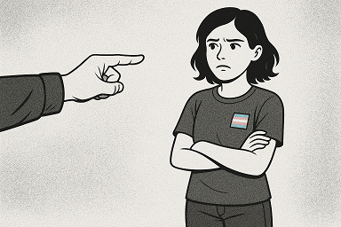
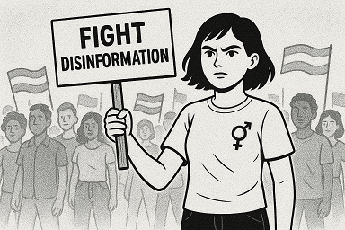
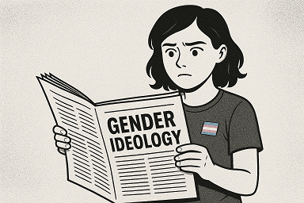
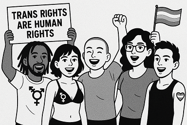

# Recognizing transphobia in yourself and others

By River Champeimont, August 19th, 2025

While the previous years have felt like we, trans people, were globally
gaining acceptance, 2025 feels like an “Empire Strikes Back” moment. We
now live in a pandemic of disinformation aimed at spreading fear against
trans people and taking away our rights, in the UK, in the US (federal
and many states), and even in some Canadian provinces (despite Canada
being one of the most trans-friendly places in the world).

## The TERF Trick

You might be familiar with the logic used by anti-abortion activists who
call themselves “pro-life”.

For example, if someone talks about the **“sanctity of life”**, you
might think that they mean things like “I oppose wars, capital
punishment, factory farming, and support programs that protect human
life like vaccination and welfare”.

What they might really mean is “I’m against abortion and assisted
suicide”.

The anti-trans activists use the same trick. If someone talks about
**women’s rights**, they might mean things like “I want to empower young
girls to have ambition, I want to fight misogyny and the patriarchy, I
want more women in positions of leadership, I want to help against
menstrual precariousness, we need to do more to fight domestic
violence”.

But what they might really mean is “We need to ensure trans women are
not legally recognized as women because they are the major threat
against real \[non-trans\] women”.

If you want an example, take “For Women Scotland”. You might expect them
to be a generalist feminist organization, but if you look at their
website, you will notice their content is exclusively focused on
fighting against trans rights (and more specifically trans women’s
rights) and spreading disinformation about trans people. They don’t have
a single article about something other than trans people.

This is what in the community we call a **TERF organization**
(Trans-Exclusionary Radical Feminist). They are people who have been
poisoned with the unfounded idea that the biggest threat to women’s
rights and safety in the current era is trans women (not tradwife
ideology, not domestic violence, discrimination, etc.). One of the most
(in)famous TERFs is of course J.K. Rowling, who is actively using her
wealth to fight against trans rights.

Note that a lot of them might be acting in good faith, just like some
people genuinely believe that global warming is a hoax or that vaccines
are dangerous, even though we know that facts contradict their
worldview.

Of course, some might openly call themselves TERFs or more likely
“gender-critical feminists”, but sometimes they’ll just present
themselves as feminists, and it’s only when you dig into what they
actually do for women that you’ll understand that their focus is
fighting against trans people.

Do you think you won’t be tricked that easily? I’ve been baffled how
even educated people can completely fall for the TERF trick, and not
realize their interlocutor means “women’s rights” in the TERF sense.

## Have You Been Poisoned by Transphobia?

I recently read “I Shall Wear Midnight” by Terry Pratchett. In this
fantasy story, the main character, a witch, is facing growing prejudice
based on unfounded fears against witches, even though she is always
helping people. In the story, the prejudice that spreads in people’s
minds is described as a **poison**.

Similarly, you might have integrated as true some anti-trans lies, just
because they appeal to what we consider common sense, but which is
really internal prejudice. As one of the characters in a fiction novel
by Robert A. Heinlein said “You can sway a thousand men by appealing to
their prejudices quicker than you can convince one man by logic”.

I myself used to hold many of these transphobic beliefs true, just
because I heard them and they felt intuitive, but I never fact-checked
any of them. Having these beliefs very likely prevented me from
realizing earlier that I was trans and transitioning (this is called
“internalized transphobia”). For instance, I hadn't realized at the time
that The Economist was spreading some of these false beliefs and I
believed them, because I considered them to be a reputable source.

So, let’s check some common prejudices you might have about trans
people. Here is a list of misconceptions that might intuitively seem
true but are not.

**Misconception:** Most trans people are trans women.  
**Reality:** There are roughly as many trans men as trans women, and 1/5
of non-binary people \[1\].

**Misconception:** Trans women are attracted to men.  
**Reality:** Trans people can have any sexual orientation. Trans women
can be lesbians, bi or straight \[2\].

**Misconception:** All trans men/women want surgery to change their
genitals.  
**Reality:** What each trans person needs as part of their transition is
very personal. Some trans people feel a great discomfort about their
genitals and want bottom surgery, while some are comfortable with an
androgynous body and don’t want it (like me! See [<u>my previous
article</u>](https://www.thepurple.blog/post/what-does-it-feel-like-to-be-trans)).

**Misconception:** Non-binary people are not trans; they just have a
non-conforming appearance.  
**Reality:** “Non-binary" means all people whose internal sense of
gender is neither feeling entirely like a man or a woman. Some
non-binary people will adopt an androgynous appearance, but some will
present traditionally masculine/feminine, just like men and women can
present in a gender conforming or non-conforming way.

**Misconception:** Trans women are still like males from a biological
point of view.  
**Reality:** Internal biology of trans women who takes hormones (most of
us do if we can \[2\]) is closer to that of biological females than
biological males, because most organs are influenced indirectly by
hormones rather than directly by sex chromones, for example: fat
distribution (= “feminine” vs “masculine” body shape), body/face hair
growth, hairline shape, baldness, sex drive, muscular strength \[3\],
breast growth, voice breaking. This is of course symmetrical for trans
men. On the other hand, what is really controlled directly by sex
chromosomes is which genitals you have.

**Misconception:** Trans women in women-only spaces are a threat to
cis\* women.  
**Reality:** Allowing trans women in women-only spaces is safe \[4\]. On
the other hand, forcing trans women in men-only spaces puts them at risk
\[5, 6\].

**Misconception:** It’s a choice to be trans.  
**Reality:** You can **discover** that you are trans, but you already
are. Also, it’s not possible to make trans people not trans anymore
(just like you can’t make gay people straight), and trying to do so is
dangerous for them \[7\].

**Misconception:** Trans women have a physical advantage over cis\*
women.  
**Reality:** Trans women who take hormones lose their advantage compared
to cis women and become similar in terms of strength after a few years
\[3\]. This phenomenon is well-known by trans people and part of their
transition experience, as I noticed myself. There might be some slight
advantages or disadvantages on very specific physical abilities. \[3,
8, 9, 10\]

\**cis* = the opposite of *trans* (e.g. “cis women” means non-trans
women)

*To learn more about the debunking of anti-trans arguments, you can read
[<u>my more specific
article</u>](https://www.thepurple.blog/post/a-trans-woman-debunks-anti-trans-rhetoric)
which digs deep into the arguments and their refutation.*

## Before You Go: Recognizing Transphobic Vocabulary

A last point to be careful about is that anti-trans activists have
developed a special vocabulary to refer to trans people in a derogatory
way. Any use of the terms below is a very strong indicator that the
person talking to you is transphobic, or that they have been poisoned by
transphobic ideas:

**Transphobic term:** Trans-identified males/females (or TIMs/TIFs)  
**Correct term:** Trans women/men  
**Why it’s wrong:** Those terms imply trans people are lying or
delusional about their gender. Also, those terms are deliberately
misgendering the people they refer to (to hurt them).

**Transphobic term:** Gender ideology / Transgenderism  
**Correct term:** Gender identity  
**Why it’s wrong:** The word “ideology” implies our gender is not real,
once again implying deceit or delusion. The “ism” in “transgenderism” is
the same, it implies it’s an ideology.

**Transphobic term:** Autogynephilia (or AGP)  
**Correct term:** None  
**Why it’s wrong:** Autogynephilia is an old theory that tried to
portray gender identity as a sexual perversion.

*So don’t fall for it, and don’t use those derogatory terms!*

## Conclusion

For some reason, we trans people have become a focus of hate and
disinformation, probably because gay people are now “too accepted” to be
a good target for fearmongering in Western democracies, so we now became
the next target. But we are still at the edge of acceptance (of the
Zeitgeist as I would have explained [<u>in this article I wrote 2 years
ago</u>](https://www.thepurple.blog/post/the-future-moral-zeitgeist)),
which is messy and variable, and we have to fight our way there.

## References

\[1\] Office for National Statistics (ONS), released 6 January 2023, ONS
website, statistical bulletin, [<u>Gender identity, England and Wales:
Census
2021</u>](https://www.ons.gov.uk/peoplepopulationandcommunity/culturalidentity/genderidentity/bulletins/genderidentityenglandandwales/census2021) 

\[2\] James SE et al. [<u>The Report of the 2015 U.S. Transgender
Survey</u>](https://transequality.org/sites/default/files/docs/usts/USTS-Full-Report-Dec17.pdf).
National Center for Transgender Equality 2016.
[<u>http://www.ustranssurvey.org/reports</u>](http://www.ustranssurvey.org/reports). 

\[3\] Ada S Cheung, Sav Zwickl, Kirsti Miller, Brendan J Nolan, Alex
Fang Qi Wong, Patrice Jones, Nir Eynon, The Impact of Gender-Affirming
Hormone Therapy on Physical Performance, *The Journal of Clinical
Endocrinology & Metabolism*, Volume 109, Issue 2, February 2024, Pages
e455–e465, [<u>https://doi.org/10.1210/clinem/dgad414</u>](https://doi.org/10.1210/clinem/dgad414)

\[4\] Hasenbush, A., Flores, A.R. & Herman, J.L. Gender Identity
Nondiscrimination Laws in Public Accommodations: a Review of Evidence
Regarding Safety and Privacy in Public Restrooms, Locker Rooms, and
Changing Rooms. *Sex Res Soc Policy* **16**, 70–83 (2019).
[<u>https://doi.org/10.1007/s13178-018-0335-z</u>](https://doi.org/10.1007/s13178-018-0335-z) 

\[5\] Gabriel R. Murchison, Madina Agénor, Sari L. Reisner, Ryan J.
Watson; School Restroom and Locker Room Restrictions and Sexual Assault
Risk Among Transgender Youth. *Pediatrics* June 2019; 143 (6):
e20182902.
[<u>10.1542/peds.2018-2902</u>](https://publications.aap.org/pediatrics/article-abstract/143/6/e20182902/76816/School-Restroom-and-Locker-Room-Restrictions-and) 

\[6\] Impact of Bathroom Discrimination on Mental Health Among
Transgender and Nonbinary Youth. Price-Feeney, Myeshia et al. Journal of
Adolescent Health, [<u>Volume 68, Issue 6, 1142 -
1147</u>](https://www.jahonline.org/article/S1054-139X(20)30653-4/fulltext)

\[7\] Conversion practice recall and mental health symptoms in sexual
and gender minority adults in the USA: a cross-sectional study. Tran,
Nguyen K et al. The Lancet Psychiatry, [<u>Volume 11, Issue 11, 879 -
889</u>](https://www.thelancet.com/journals/lanpsy/article/PIIS2215-0366(24)00251-7/abstract)

\[8\] Hamilton B, Brown A, Montagner-Moraes S, Comeras-Chueca C, Bush
PG, Guppy FM, Pitsiladis YP. Strength, power and aerobic capacity of
transgender athletes: a cross-sectional study. Br J Sports Med. 2024 May
28;58(11):586-597. doi: 10.1136/bjsports-2023-108029. Erratum in: Br J
Sports Med. 2024 Oct 17;58(19):e10. doi:
10.1136/bjsports-2023-108029corr1. [<u>PMID:
38599680</u>](https://pubmed.ncbi.nlm.nih.gov/38599680/); PMCID:
PMC11137468.

\[9\] Harper, Joanna. (2015). Race Times for Transgender Athletes.
Journal of Sporting Cultures and Identities. 6. 1-9.
[<u>10.18848/2381-6678/CGP/v06i01/54079</u>](https://cgscholar.com/bookstore/works/race-times-for-transgender-athletes).

\[10\] [<u>Transgender Women Athletes and Elite Sport: A Scientific
Review</u>](https://cces.ca/transgender-women-athletes-and-elite-sport-scientific-review),
Canadian Centre for Ethics in Sport
