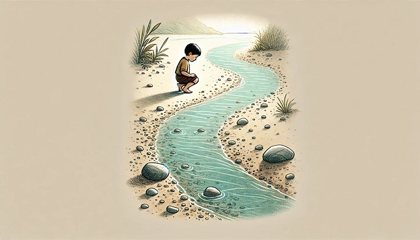
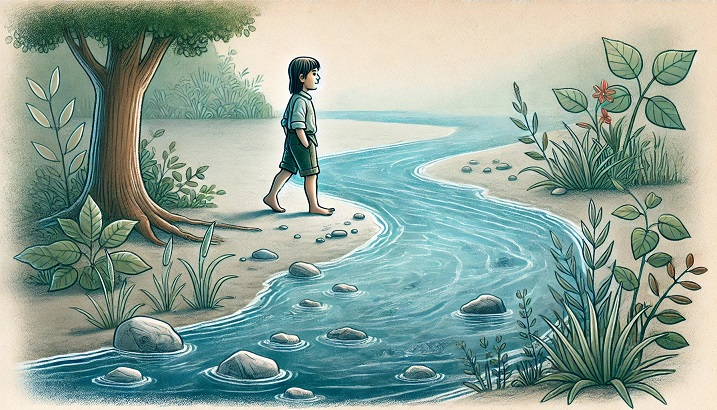
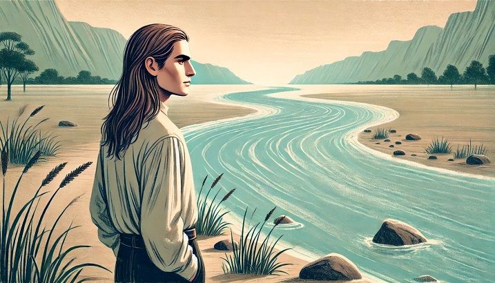
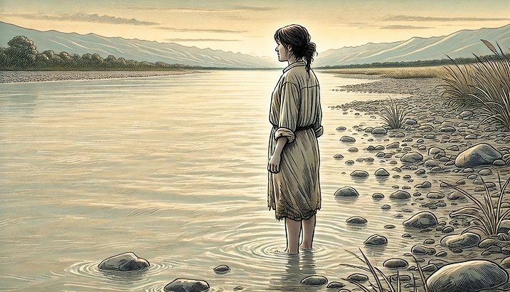
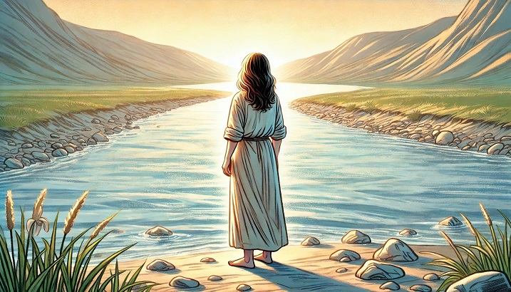

By River Champeimont, November 16th, 2024

This is a micro-article about an extra reason why I chose “River” as my name.

Every day of your life, you've walked a bit farther along the river, following the current.

As a kid you were always curious about the river.

It would have been easy to cross the river at the beginning, as it was only a small stream back then, but you were told it was forbidden, and you didn’t see any reason to do it. No one ever crossed the river.

So, you kept walking along the river for decades. And one day, you realize you’re on the wrong side.

But now, the river has become a wide, rushing body of water, and the other bank is far away.

But finally, you decide to cross anyway. This was hard. But you made it.

And now you live on the other side. And you are happy.

