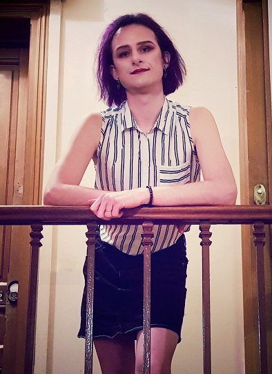

By River Champeimont, Nov 9th, 2024

# Transitioning in Ontario, Canada: One Year In

_It’s been a year since I began my transition, and I feel incredibly lucky to be on this side of the border. With everything going on elsewhere, I’m grateful for the supportive environment Ontario offers to trans people. Living here has made all the difference._

---

## One Year Milestone

This month marks a full year since I started my transition. To celebrate, I took a moment to reflect on everything I’ve been able to leave behind. I wrote down things that my transition has allowed me to let go of, and I burned them in a small ritual to mark the growth and change of this past year.

---

## Changing My Name and Gender Marker in Ontario

One of the most significant parts of my transition has been changing my name and updating my documents to reflect my true self. In Ontario, this process has been incredibly straightforward and supportive, which I know isn’t the case everywhere.

To change my name, the requirements are simple. You just need to have lived in the province for the past 12 months and write a short statement explaining why you’re changing your name. No long proof of prior usage or extensive documentation needed—just a brief explanation. This simplicity made the experience far less stressful.

Access to HRT is also very simple if you go through a private clinic. I was able to start HRT in about a month. I know this isn’t the experience everywhere, so I feel fortunate to have found accessible and supportive private healthcare options here.

Updating my gender marker was just as easy. Ontario allows for an “X” option for non-binary people, which is a big step for inclusivity. I initially changed my marker to “X,” which only required a visit to ServiceOntario on a Saturday. I waited in line, told the clerk I wanted to change my gender to "X," signed a form, and a few weeks later I had an updated ID.

Later, as I realized I’m a trans woman, I decided to change my marker to "F." All I needed was a document from my HRT provider. I went back to ServiceOntario, signed a form, and now my ID and medical records reflect "F." This step felt like an important recognition of who I am.

Ontario also allows trans people to use the bathrooms that align with their gender identity, an important aspect of daily life that often goes overlooked but makes a big difference. Having this kind of inclusive policy helps create a safer, more comfortable environment for people like me to live authentically.

---

## Why Canada?

Interestingly, I didn’t choose Canada specifically for its trans-friendly environment—I didn’t even know I was trans when I applied for immigration five years ago. However, I did know I wanted to be in a country that was LGBTQ+ friendly, as I already identified as part of the LGBTQ+ community. I even "benchmarked" potential cities by visiting the "gay villages" in Vancouver and Toronto to get a feel for the community before making my decision. 

Looking back, I think I already knew, in some way, that I wasn’t entirely gender-conforming. This picture of me from a few years ago says a lot—I wasn’t out as trans yet, but I was definitely exploring my identity in subtle ways. 

Moving to a place where I felt safe to explore that side of myself was more meaningful than I realized at the time.

---

## Looking Forward

With these steps completed, I feel more excited about what’s ahead. Having documents, healthcare, and a supportive environment that align with who I am has made a huge difference. Living in Ontario, with its supportive policies, makes me feel safe and seen.

I know not everyone has this privilege, but I hope sharing my experience helps show how progressive policies make a real difference for trans people and contribute to a safer, more inclusive world.
