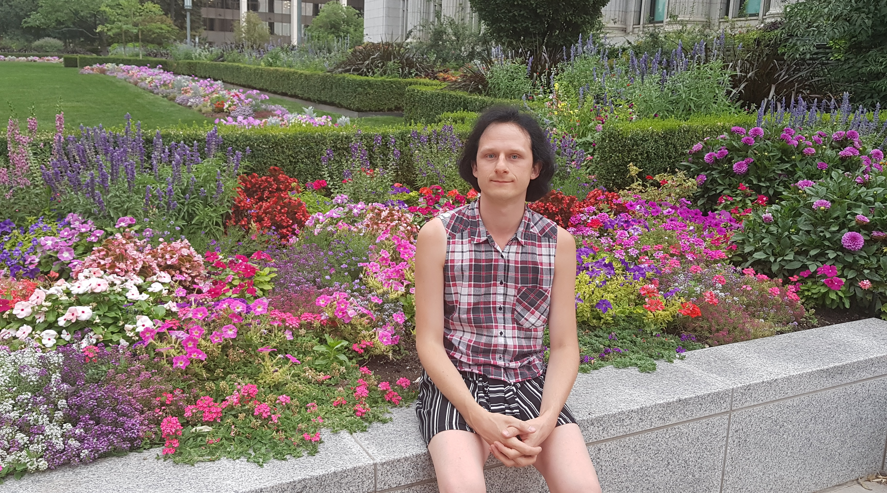
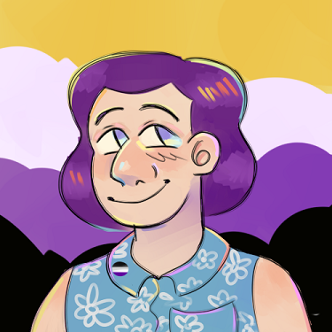

By River Champeimont, February 17th, 2024.

# Waking up non-binary
Last year, I discovered I was a transgender non-binary person. Here is what happened.

## What’s non-binary?
To say things simply, I am “half a trans woman”. Just like a trans woman, I am AMAB (assigned male at birth, basically someone born with a penis), but unlike a trans woman, I identify only partially as a woman. There are other ways to be non-binary (or “enby”, as people in the community say), but the general definition is anyone who does not fully identify with one of the 2 “usual” (= binary) genders.

You can also be non-binary and AFAB (assigned female at birth), which seems to be slightly more frequent in fact, but here I’ll talk about my own experience being non-binary and AMAB.

Being non-binary should not be confused with being intersex, which means you have a mix of both biological sexes, for instance by having ambiguous genitalia or sex chromosomes which are neither XX nor XY.

Also, non-binary is a subcategory of transgender (we are in the T of LGBTQIA+, although personally I’m also in the B and A). But “trans” is often thought to mean only trans men and women, which is why you might read “trans and/or non-binary people” sometimes. Also, some non-binary people don’t refer to themselves as trans. Personally, I refer to myself as trans and non-binary.

## Victim of a trend?
Perhaps one of the most surprising things about realizing I was non-binary was the realization that I had done so many things because of it in the past, even though I was completely ignorant of the concept. There is therefore no way I could be the victim of a “trend” and just wanted to mimic other cool non-binary people. Being non-binary has been like an invisible force in my mind that pushed me to do things even when I was not aware of it. I now realize I was already non-binary even in my early childhood, even though I did not know (just like I sometimes fell in love with boys long before learning about the idea of “gay”).

More than a decade ago, I learned about the concept of being trans (binary), but it wasn’t until a few years ago that I heard about the concept of being non-binary. Since a lot of “signs” are very similar between being a trans man/woman and being non-binary, the question of whether I was a trans woman came out sometimes.

Especially in the summer, people would sometimes spontaneously refer to me as a woman in shops because I dressed in a feminine and cute way. People who knew me and for whom I was a man were sometimes surprised that I did not correct others when they did that. But I just let it be because it felt good! Other examples would include being asked if I use feminine pronouns to refer to myself, or why I wanted to dress in a feminine way. When I tried on clothes in stores, I always asked my wife “Do I look girly?” and if the answer was not a clear yes, I would not buy them.

You might be thinking, “Come on, weren’t it obvious you were trans?”. The thing is, I knew I did not want to identify as a woman. Also, I had more pressing things to think about, like building a company! But anyway, I did not want to fully pass for a woman, I just felt good when looking androgynous. At that time, I thought “Ok I’m just a man who also likes being feminine”. I thought at the time that this was just a choice.

## 25 incorrect rationalizations
When I started questioning my gender, I wrote a document listing all the “clues” that suggested I was non-binary. After I finally accepted that fact, I then thought again about all the things that happened in my life that were obvious clues too. Every once in a while, I would then remember yet another event and think “Oh there was that too!” and added it to the file. I ended up listing 25 items there. Overwhelming evidence!

So how did I not suspect I was trans/non-binary each time one of these things happened in the first place? The reason is I always invented an ad-hoc rationalization to explain it in another way than being trans: “Oh, I just like cute things”, “Oh, I just don’t like being associated with the cliché of the very masculine man”, “I wanted to be a girl as a kid simply because I just wanted to play with girls”, “I just spend all this money in laser hair removal because I think I look better”, “I want to do laser hair removal on my face because it saves time on shaving”. So many ad-hoc hypotheses. All of these dozens of weird rationalizations could be true, but there is a single alternative hypothesis which explains it all: I’m trans/non-binary. Let’s use Occam’s razor here and go with the simple hypothesis.

## Gender dysphoria!
Gender dysphoria is the negative feeling (like being disgusted in yourself) that you feel when you are “reminded” of things that are linked to your assigned gender at birth (like their beard, hair on their chest, balding patterns, etc. for trans women). It’s very common for trans binary people and to a lesser extent for non-binary people.
When I started realizing I was non-binary, I was reassured by being told that I did not need to have gender dysphoria to be trans/non-binary. This reassured me because I did not think I had dysphoria, so I was still “allowed” to be non-binary. But weeks after realizing I was non-binary, I realized I had in fact a lot of gender dysphoria, I just did not think of these things as such.

## Meeting non-binary people
So how did I finally figure it out? I am embarrassed to say that it’s not because I spontaneously did research and finally discovered the concept.

What happened is much simpler: I met non-binary people. Initially, I was skeptical of the concept, I thought it was not something “real”, like maybe it was just a fashionable idea in North America and people liked being non-conforming. Also, I thought “Come on, if just being like that makes you non-binary, then I could claim I’m non-binary too because I do all those things, even though I’m not a non-binary person”. Of course, I missed the other logical alternative: I am like them because I am non-binary too!

An avatar drawn for me by a genderless friend

## The Wizard of Gender
One of the amazing resources that helped me with my final epiphany was the website “Turn me into a non-binary person” which is a variant of the original “Turn me into a girl”. The fundamental idea here is that if you have a very strong desire to be non-binary (or a girl in the other variant), then it means you already are one!
The serious point here is that cis (= non-trans) people don’t have a super strong desire to be non-binary or the other gender, if any desire at all.

## What if gender is just an illusion?
I always wondered, if we lived in a future where all stereotypes of gender have disappeared and everyone was able to behave in any way independently of their gender, would it still make sense to say I’m non-binary? Would it still make sense for people to be trans in general?

I think so, because there would still be things that trans people would seek, like changing their appearance with HRT (Hormone Replacement Therapy) to avoid gender dysphoria. We don’t necessarily do things like HRT or surgery to gain the rights of the other gender, but because it makes us feel better. Maybe in a post-gender society, anyone would just do HRT if they feel they would like to?

## Transition!
I hesitated a lot before posting this, because I feared people would question my gender identity.

But in fact, I’m really 100% certain that I’m trans. However, there may still be a slight chance that I'm wrong about being non-binary and that I might actually be a trans woman, like 95% probability of being non-binary and 5% of being a trans woman.

I don’t know if I’ll write new articles about this in the future. Some trans folx love talking about their transition (changing pronouns, legal documents, hormones, etc.) and I’m thankful to them for creating these resources* because it helps other trans people a lot!

\* For instance, you can watch YouTube videos from channels Hannah Phillips or The Chloe Connection.
