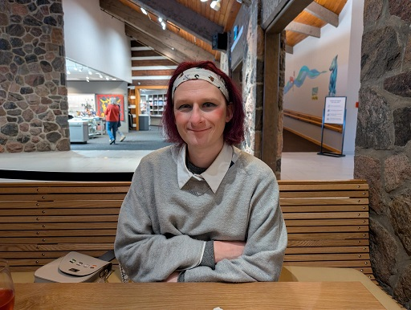

This is an article I originally wrote for the [HAT Newsletter](https://mailchi.mp/55c9ef265127/hat-february-2025-news) and that was [published here](https://www.humanisttoronto.ca/more-than-atheism).

# We are more than atheism

_River Champeimont - January 23, 2025_

My name is River and I’m a transgender woman. After a long part of my life living as a gender I was not and trying to “work around it” as much as I could, I finally understood I was trans and transitioned.

People sometimes wonder what it feels like to be trans. For me the post-transition state is a feeling of peacefulness, as if some permanent feeling of discomfort I had felt all my life was now gone. Feeling seen as a woman fills me with joy. Being trans is a really weird experience, probably completely unrelatable if you are not trans yourself. So many of us trans women make great efforts to look more feminine, to feel more feminine, and enjoy being “accidentally” read as women, even before realizing we are trans.

Now that I have transitioned, I can just act naturally without having to be careful that my behaviour would be out of character with the gender I’m supposed to be. I could never be completely natural in the past. And I didn’t want to be too visible: If it’s to be seen as a man, I’d rather hide and not be seen.

Now, when people misgender me, it feels “disgusting”, like a feeling of disgust in myself. I’m like “ew, they see me like that”. That’s why it hurts, it makes you feel disgust for yourself. At least that’s how it feels for me.

Transitioning is amazing, I discovered that I could actually like my reflection in the mirror and think “wow I look good” and realize this is this first time I feel that in my life.

So, what does all of it has to do with humanism? A lot of people in the world seem to be really pissed off by the fact that we are living as a different gender than our biological sex. They insist we live miserably as our “correct” gender instead.

Surprisingly, the hate does not only come from conservative religious people. Richard Dawkins, perhaps the most well-known atheist advocate, has been pretty vocal about the fact that we should not call trans women “women”, that athlete Imane Khalif is a man [1] (which is offensive to say about a trans woman, and in fact she is not even trans at all), and even posting transphobic jokes [2]. This hurt me so much when I discovered that, after being a big fan of him and putting a citation from one of his books as the opening citation of my PhD manuscript [3].

He insists that we should not call “women” people who are not biological women because it’s denying biology. Maybe you have noticed, but people don’t use words in their day-to-day life in the same sense than biologists. When people say the word “animal” they mean a non-human animal of course, since humans are animals from a biology point of view. But we don’t hear biologists saying “hey you are using the word animal wrong, you mean non-human animal” every time someone says the word “animal” (imagine singing “just like non-human animals, non-human animals-mals” in the “Animals” song from Maroon 5).

I’m a lesbian which means I’m attracted to women (and sometimes to fem-looking non-binary people). I’m not attracted to biological women, I’m attracted to women in the “woke” sense. If I meet a trans man (who is a therefore a biological woman) I won’t find him attractive at all, on the other hand I am attracted to trans women (although they are not biological women). So, in this context the word “woman” as trans people use it makes sense, not the biological one. This is one of the things we mean when we say that “trans women are women”.

In the end, whether we allow trans people to live in society as the gender they want is a matter of values. Do we believe in Freedom? Do we value trans people’s happiness? Biology does not tell us whether we should allow trans men in men’s bathrooms and trans women in women’s bathroom. Pretending otherwise is using science to say what things should be, and it doesn’t tell us that. It’s the same as biologists who were pointing at biological differences between races and using them to justify racism in the last century.

That’s the difference between being just a rational thinker and being a humanist. Interestingly, I have met people that I would consider to be humanists in “affirming congregations” of the Canadian United Church. As I see it, being among humanist people is being with people who put human happiness first before anything else, whether it is ideology, biological or vocabulary purity.

Sources:
* [1] https://en.wikipedia.org/wiki/Views_of_Richard_Dawkins#LGBT_issues
* [2] Tweet by Richard Dawkins posted on Aug 8th, 2024
* [3] https://theses.hal.science/tel-01118660v2/document
