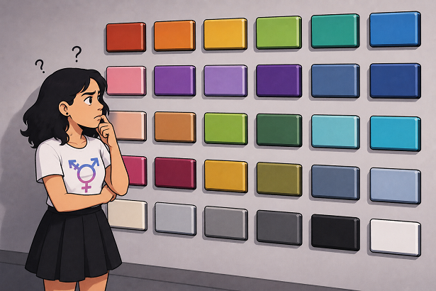

# What is your favorite color?

By River Champeimont, July 25th, 2026

Suppose you were telling someone that your favorite color is green, and
they started questioning it and asking you to justify yourself. You'd be
pretty surprised. However, that's exactly the kind of questions we're
asked as transgender people to justify our gender. Let's explore them.

## How can I know it's true from the outside?

If someone asked for external proof that your favorite color is green,
you'd be puzzled. How can you *prove* it's green to someone who can't
read your mind? Sure, you could show them objects or clothes you own
that are green, but you probably own plenty of things in other colors
too.

Similarly, when we're asked to justify our gender, like I had to do for
a French court to get my legal gender changed, we can indeed show some
“evidence”. For instance, I showed pictures of myself in feminine
clothes, people addressing me with feminine pronouns, and testimonials
from people saying I lived as a woman. But we could gather just as much
“evidence” that I'm a man by showing pictures of me before my transition
or people who aren't aware of my transition misgendering me. I'm the
only person who can actually know my true gender.

If a kid said their favorite color was purple, but was told that it was
an inappropriate favorite color, they might start pretending their
favorite color was red instead. If they lied consistently enough,
everyone could believe them. But only that kid would know their real
favorite color.

## How do we know it even exists?

Sometimes people question whether gender even exists. The argument goes
like this: if you're the only one who can tell which gender you are,
then it's not a real concept and it's just your imagination.

However, everyone accepts that favorite colors are a thing, even though
we literally have no choice but to trust the person whose favorite color
it is. We also understand that someone can *lie* about their favorite
color, meaning we understand that the person has a *real* favorite color
which exists intrinsically and independently of what they tell you.
People will, in fact, even assume that you have a favorite color.

## Does science know why?

No one even questioned your favorite color by asking if science has
understood why your brain “has that favorite color”, yet we accept it’s
a thing. No one seems to care whether science has determined what makes
you have this favorite color over another, yet it is accepted as a valid
concept nonetheless. Science doesn’t even know whether everyone actually
sees the same color.

## Why pick this one?

Why do I want to "be a woman"? Wouldn't it be better to be a man since
men have more privilege in society?

Just as you can't choose to change your favorite color, I can't choose
another gender. You could think of it this way: I “like being a woman”,
whatever the practical pros and cons are. They're irrelevant.

No one would argue that you should change your favorite color because,
say, clothes in another color are easier to find because that dye is
cheaper. It's just not your favorite color, and you understand there's
no point in arguing about it.

## Do you have several favorite colors?

Just as with favorite colors, where someone might genuinely have several
favorites (or none at all), gender has a lot of diversity. Some people
feel like they have several genders, while others feel like they have
none.

That might be unrelatable to you, and it's also unrelatable to me, since
I strongly feel like a woman. But I know very well that being a
different gender from my sex (ie. being transgender, by definition) is
unrelatable for most people.

We can't understand every human experience just by looking inside our
own minds. For instance, I can't understand why someone would want to be
a man. Even the experience of trans men feels like some weird reversed
world to me: *What? You like having a beard, going bald, and having a
deep voice? Sounds fake, but okay...* Trans men celebrating their
transition steps are among the most unrelatable things to me, but I can
still understand them intellectually because they're essentially the
mirror image of my own experience.

## Why not purple?

Interestingly, favorite colors seem to be linked with gender. Purple, in
particular, is very rarely men's favorite color (\< 1%), although it's
reasonably common for women (23 %) \[1\].

I'm honestly wondering whether men really don't like purple, or whether
boys are discouraged from saying purple is their favorite color because
it's feminine-coded in our society. Maybe they pick their second
favorite instead and say it's their favorite.

Here the analogy stops, because it's much easier to spend your life
pretending, to others and to yourself, that your favorite color is a
different one than to live as the wrong gender. Maybe you can even truly
change what your favorite color is if you are bullied enough, which
doesn’t happen for transgender people with their gender.

But just like that hypothetical boy who likes purple, we transgender
people are taught to silence our feelings. We're told to prefer living
as another gender, the one corresponding to our sex (how much more
convenient for society!).

## Conclusion

What I think we should take away from this analogy is that some parts of
the human experience are very real and important to the people living
them, even when they are not visible or measurable from the outside. We
accept as real many things that only the person living them can tell,
like favorite colors, joy, pain, anxiety… and gender is just one of
those things.

## References

\[1\]
[<u>https://blog.vmgstudios.com/brand-color-psychology-men-vs.-women</u>](https://blog.vmgstudios.com/brand-color-psychology-men-vs.-women)
